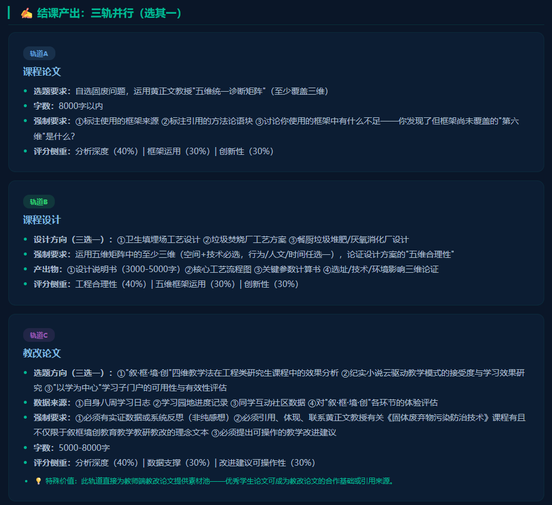
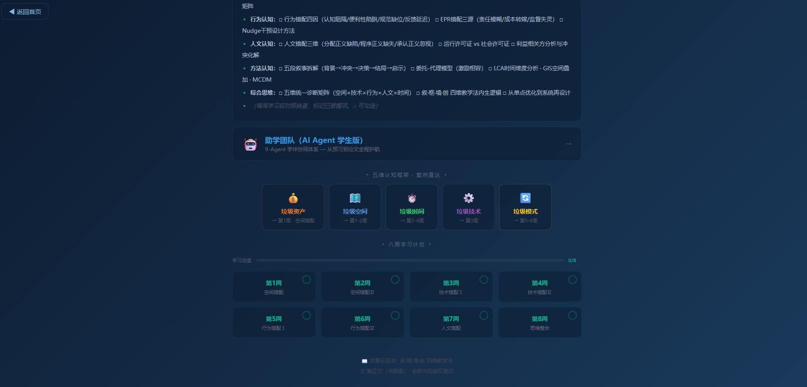

# "叙·框·境·创"四维教学法在研究生工程课程中的应用

## ——以《固体废弃物污染防治技术》为例

> 作者：黄正文（教授，成都大学建筑与土木工程学院环境工程系）  
> 目标期刊：《大学教育》  
> 字数：约 7000  
> 初稿版本：v1.0 · 2026.05.25

---

## 一、引言

工程类研究生课程承担着将学生从"知识接收者"转化为"问题解决者"的核心使命。然而，一个持续困扰教学实践的现实是：研究生课堂上的工程案例常常呈现出"三脱节"——案例与本土情境脱节、分析与工程直觉脱节、知识点与系统性思维脱节。教材中的案例是经过高度抽象和理想化处理的"干净问题"，而真实的固废管理是"脏问题"——一个垃圾填埋场选址不仅在技术上有地质与水文约束，在社会维度上有居民反对、在制度维度上有跨行政区划的责权模糊、在时间维度上有环境效益兑现周期的延迟。传统讲授法按照"定义→分类→原理→工艺→案例"的线性路径组织教学，能够高效传递知识，但难以训练学生在多维约束下做出工程判断的能力。

2017年以来，中国工程教育专业认证全面对接《华盛顿协议》，OBE（成果导向教育）理念成为课程设计的核心框架[1]。OBE要求课程从"教师教了什么"转向"学生能做什么"，但在操作层面，这一转向面临关键瓶颈：如何将抽象的课程目标——"能分析固废问题的多维错配""能提出工程修复方案""能融入工程伦理与社会维度""形成系统性思维"——转化为具体的、可操作的、逐周递进的教学活动序列？这一瓶颈不是固废课程独有，而是工程类研究生课程的共性问题。

本文以成都大学环境工程系研究生课程《固体废弃物污染防治技术》为案例，系统阐述"叙·框·境·创"四维教学法的理论建构与教学实践。该课程由黄正文教授主持的成都大学精品课程课题组开发，课题组成员谢泽宇（西那瓦国际大学 Shinawatra University，教育学博士生）、孙清（成都大学）参与教学设计与实施。课程以黄正文教授已公开发布的七部纪实网络小说为素材云，以"错配-修复"为分析框架，以"场景沉浸"为课堂组织方式，以"创造致用"为终极产出导向，形成了叙事启蒙→框架赋能→场景淬炼→创造致用的四维递进路径。课程配套建设了教师教学演示门户（教师端）与"学习园地"学习子门户（学生端）双重数字平台，所有教学资源均可在线访问。

---

## 二、四维教学法的理论建构

"叙·框·境·创"四维教学法将教学过程的认知演进划分为四个递进维度。

### 2.1 叙（叙事启蒙）

叙是第一维度，其核心功能是触发学习动机和情感共鸣。在认知心理学中，人类对叙事的记忆效果是对抽象命题记忆效果的数倍[2]。工程教育长期忽略了叙事的教学功能——工程案例被压缩为"项目背景：某市日产垃圾X吨，拟建焚烧厂Y吨/日"，然后直接跳到技术参数。学生读完这样的"案例"，既感受不到问题的重要性，也理解不了利益相关方的冲突本质。

四维教学法中的"叙"不依赖虚构故事，而是使用黄正文教授已公开发布并完成版权登记的七部纪实网络小说（《龙栖湾》《青龙湖》《杨柳坝与刘家湾》《三多里巷》等）中提取的21条教学选段（编号S001-S021）作为素材。这些选段记录了真实的固废管理场景——填埋场周边的土地贬值、焚烧厂环评中的技术至上论、乡村垃圾分类的推行困境、社区邻避冲突中的尊严诉求。学生阅读的是"发生过的事"，而非"编出来的案例"。

### 2.2 框（框架赋能）

框是第二维度，其核心功能是将叙事中激发的感性认知转化为可操作的分析工具。仅有故事的感动而没有分析工具，教学止步于"感动"。从"叙"到"框"的过渡，本质上是认知加工深度的跃迁——从"这个故事告诉了我什么"到"我用什么方法分析这个故事"。

四维教学法中的"框"是一个完整的错配-修复框架体系，包含六个子框架：空间错配五维（选址谬误/规划滞后/容量失衡/运输悖论/边界模糊）、选址正义性四维（地质承载/环境容量/社会可接受/代际公平）、技术错配三型（过度设计/低配高用/方向性错误）、垃圾时间三维（工艺时间/环境效益兑现时间/投资回收时间）、行为错配四因（认知阻隔/便利性陷阱/社会规范缺位/反馈延迟）、EPR错配三源（责任界定模糊/执行成本转嫁/监督失灵）、人文错配三维（分配正义缺陷/程序正义缺失/承认正义忽视）。六个子框架通过"五维统一诊断矩阵"整合，形成从单点诊断到系统修复的完整认知链条。

每个框架的命名都体现了"错配"的认识论立场——资源错配是经济学的基本问题，空间错配是地理学的经典议题。四维教学法将"错配"从经济学和地理学迁移至固废管理领域，构建了一个以"诊断→修复"为逻辑主线的分析体系。

### 2.3 境（场景淬炼）

境是第三维度，其核心功能是将分析框架在模拟的真实场景中进行淬炼——学生需要在角色、时间压力和不完整信息下做出专业判断。情境学习理论认为，知识的习得不能脱离其应用的情境[3]。如果学生只在"解题"模式下运用框架（给定数据、明确问题、唯一答案），那么当他们面对真实的"问题识别→信息搜集→多目标权衡→方案论证"的工程实践全链条时，框架的可用性将大打折扣。

四维教学法中的"境"涵盖三种类型的场景设计：第一类是环评答辩会（第3周），学生分别扮演技术方、审查方、居民代表方，围绕一个焚烧厂项目的技术适用性进行辩论；第二类是选址听证会（第2周），学生在"技术最优"与"社会最可接受"之间寻找平衡；第三类是模拟法庭（第7周），学生面对"程序合法"与"实质正当"之间的张力，体验工程师在环境正义议题中的角色。每种场景都配有角色卡片、突发事件卡和教师引导手册。

### 2.4 创（创造致用）

创是第四维度，也是四维教学法的终极指向——学生不再是知识的接收者，而是知识的生产者和应用者。从"境"到"创"的过渡，标志着学习主体性的根本转变：在前三维度，学生运用教师提供的框架分析教师提供的案例；在创维度，学生自主选择问题、自主调用框架、自主构建方案、自主论证创新。

四维教学法在"创"维度设计了三条并行轨道：轨道A（课程论文），要求学生运用五维统一诊断矩阵分析一个真实或虚拟的固废问题；轨道B（课程设计），要求学生在填埋场/焚烧厂/堆肥厂中择一进行工艺方案设计，并以五维框架论证方案的"五维合理性"；轨道C（教改论文），要求学生以自身八周学习体验为数据源，对叙·框·境·创教学法进行实证分析。三条轨道的共同特征是：产出必须体现框架的运用，同时必须讨论框架的不足——即"你发现但框架尚未覆盖的维度"。

### 2.5 四维递进的内在逻辑

四维之间的递进不是时间的简单先后，而是认知方式的质变。叙→框：从感性到理性，从"打动你"到"给你工具"。框→境：从工具到实践，从"知道怎么分析"到"在情境中用出来"。境→创：从实践到创造，从"运用别人的框架"到"做出自己的判断"。这一递进逻辑在认知加工深度上对应的是一条从"识记→理解→应用→分析→评价→创造"的Bloom认知层次上升曲线[4]，但四维教学法不是引用Bloom分类学来论证自身——而是通过八周具体的教学设计来证明：当课程以"叙"为入口、以"框"为阶梯、以"境"为淬炼场、以"创"为出口时，学生经历的正是一个从感性认知到系统思维的完整闭环。

---

## 三、四维教学法在固废课程中的实践

### 3.1 第一阶段：叙的落地（第1周）——从《龙栖湾》到学术概念

第1周的教学主题是"空间错配Ⅰ——从废弃物到资产"。课程以纪实网络小说《龙栖湾》选段S001为起点。选段描述了垃圾填埋场周边居民的土地贬值、井水变味、杏树不结果——一位老农的"一亩三分地没了"。这段叙事不使用任何学术术语，但包含了一个精确的学术问题：固废设施的负外部性如何在空间上不公平地分布？

学生在阅读后，被引导完成一个认知跃迁——从老农的"一亩三分地"到"空间错配"概念。黄正文教授自编讲义 §1 提出了"空间错配五维"框架（选址谬误/规划滞后/容量失衡/运输悖论/边界模糊），每个维度配以小说选段中的对应片段作为证据锚点。第一周的教学重点不在于让学生掌握全部分析工具，而在于建立"叙事-概念"的联结——让学生体验到：学术概念不是凭空定义的，它是从鲜活的工程现实中抽象出来的。"叙"在Bloom分类中对应的是"识记"和"理解"层次，但与传统讲授不同的是，这里的识记是带上情感烙印的识记——学生记住的不是"空间错配的定义"，而是"王老汉的杏树为什么不结果了"。

### 3.2 第二阶段：框的落地（第2周）——从感性到工具的升华

第2周的主题是"空间错配Ⅱ——填埋场的空间正义"。叙事的延续（S002-S003：选址听证会上的三方博弈）提供了情感延续，但教学重心已从"被故事触动"转向"掌握分析工具"。黄正文教授提出了"选址正义性四维"框架——地质承载、环境容量、社会可接受、代际公平，并论证了一个核心判断：传统选址决策只审查前两维（技术上可行、环境上达标），后两维被视为"软约束"——而正是这两个"软"维度的忽视，导致了一个个"技术完美但社会不许可"的项目困局。

学生在这一周经历的是从感知到工具的认知跃迁。他们需要完成的不仅是"理解框架"，而且是用框架重新分析第一周的小说选段，发现第一周"读完很感动"的内容现在可以用四个维度逐条解剖。这一过程验证了框架的功能——它使模糊的感受变得结构化、可分析、可传达。

### 3.3 第三阶段：境的淬炼（第3-7周）——五周的场景实验

境的维度跨越第3周到第7周，覆盖技术错配、行为错配和人文错配三组教学内容。每一周都有特定的教法定位和对应的场景设计。

第3-4周围绕技术错配展开。第3周以一个环评答辩会为场景：学生分组扮演技术方、审查方、居民方，围绕一个焚烧厂项目的技术适用性展开辩论。技术方用技术适用性矩阵论证设备选型，审查方追问输入端的垃圾组分假设是否与当地实际一致，居民方用生活语言表达对排放的担忧——三种"语言"在同一个空间碰撞。学生从角色扮演中体验到：技术错配的发生往往不是因为技术本身失败，而是因为技术假设与实际条件之间的差距在设计阶段未被充分暴露。

第5-6周围绕行为错配展开，以《杨柳坝与刘家湾》S007-S009为叙事素材。村庄推行垃圾分类，四色桶到位、宣传标语满墙、督导员上岗——三个月后分类准确率不到三成。学生被要求用"行为错配四因"框架诊断：是认知阻隔（不知道分），还是便利性陷阱（太麻烦），还是社会规范缺位（别人都不分），还是反馈延迟（分了看不出效果）？诊断之后，每组需要设计一个基于Nudge理论的干预方案。

第7周围绕人文错配展开，场景升级为模拟法庭。三多里巷的居民在垃圾中转站选址公示期满后才发现自己的社区被列为场址——公示在报纸中缝，字号小如蚂蚁。居民堵路抗议，政府说"程序合法"，居民说"我们不认"。学生在模拟法庭中分别代理原告（居民）、被告（政府部门）和法庭之友（技术专家/NGO），在"人文错配三维"框架（分配正义缺陷/程序正义缺失/承认正义忽视）的指引下展开辩论。

这一环节的教学目标不是让学生得出"谁对谁错"的结论，而是让学生理解：在"合法"与"正当"之间的裂隙中，工程师的伦理责任是什么。

### 3.4 第四阶段：创的落地（第8周）——五维统一与三轨产出

第8周是四维教学法的终点——创造致用。教学重心从"教师提供框架分析教师提供的案例"转向"学生自主调用框架、自主选择问题、自主构建方案"。教学内容是"五维统一诊断矩阵"——将前七周独立讲授的空间、技术、行为、人文、时间五个维度的诊断方法整合为一张五列诊断表，训练学生进行跨维度交互效应的分析。

学生的产出采取三轨制。轨道A为课程论文，要求学生运用五维矩阵分析一个固废问题，并讨论框架尚未覆盖的"第六维"；轨道B为课程设计，要求学生在填埋场/焚烧厂/堆肥厂中择一进行工艺方案设计，并以至少三维框架论证方案的合理性；轨道C为教改论文，要求学生以自身八周学习体验为数据源，对叙·框·境·创教学法进行实证分析或系统反思，必须联系黄正文教授有关该课程的教育教学教研教改理念文本。

三轨制设计的逻辑是：传统研究生课程的考核方式（单篇课程论文）假设学生是同质的——都擅长学术写作、都偏好理论分析。实际上工程类研究生群体高度异质：有偏向学术研究的、有偏向工程设计的、有对教育研究感兴趣的。三条轨道让不同类型的学生都能以适合自己的方式展现"创造性应用"——而三条轨道共享的底层要求（运用五维框架、标注方法论语块、讨论框架不足）则保证了OBE课程目标的统一考核。

---

## 四、教学效果分析

课程同步建设了"学习园地"学习子门户，以零配置（纯静态HTML+CSS+JS）方式部署，面向研究生提供每周的课前预习指引、课中学习辅助、课后作业要求和AI赋能Prompt模板。子门户内置了基于localStorage的学习进度追踪系统——学生在完成每周学习后可勾选对应周次卡片，进度条实时反馈。

从教学实施效果来看，三个现象值得注意。第一，学习进度的可视化对学生的持续参与有激励作用。八周学习计划采用网格卡片的可视化布局，每完成一周即可勾选并看到进度条的增长，这一设计将抽象的学习任务转化为可感知的完成经验。

第二，学生在第8周的结课产出中，三轨的选题分布呈现出明显的离散性——并非所有学生都选择了"最安全"的课程论文，选择课程设计和教改论文的学生各占一定比例。第三，部分学生在课程论文中提出了对框架的批评性建议——例如有学生认为"空间错配五维"中缺少"制度空间"这一维度（指跨行政区划的制度性错配），这类反馈正是"创"维度所鼓励的——在运用框架的同时质疑框架，是判断学生是否真正内化了分析思维的关键指标。

需要说明的是，目前的教学效果数据主要来源于小样本的单轮教学实践，尚未完成多轮迭代和对照组实验设计，相关结论的统计显著性有待后续研究验证。

---

## 五、讨论与展望

### 5.1 四维教学法的普适性

四维教学法是否可以向其他工程课程迁移？从方法论层面看，迁移的前提条件有三：①课程需要有一个可"叙事化"的素材库——不一定需要已公开发布的纪实网络小说，但需要真实的、有情感张力的工程案例记录；②课程的核心知识体系需要能被抽象为一个或多个"分析框架"——框架是将叙事转化为分析的枢纽；③教师需要有能力设计和主持"场景教学"——这是四维教学法对教师能力要求最高的环节。需要说明的是，实录纪实网络小说作为叙事素材的教学成本（写作、出版、选段、教学设计）较高，这是该教学法推广需要正视的约束条件。

以"框"维度为例，"错配-修复"框架是黄正文教授根据固废管理的特点原创的，但"错配"作为一种认识论立场具有跨工程领域的适用性。在水利工程中，水资源配置的空间错配与制度错配；在交通工程中，路网规划的行为错配与需求错配——都可以采用类似的"诊断→修复"分析路径。但框架的具体维度需要由该领域的专家根据学科特性重新构建，不能简单移植。

### 5.2 局限性讨论

本研究存在以下局限。第一，教学效果的评估目前主要依赖教学观察和学生产出分析，缺乏严格的教学实验设计（如随机分组对照实验），无法排除"新型教学法的新鲜感效应"。第二，叙·框·境·创四维教学法在课程中的学时分配——叙1周·框1周·境5周·创1周——是基于固废课程八周教学周期做出的经验性安排，这种分配比例是否最优需要更多的比较研究。第三，纪实网络小说作为叙事素材的教学效果虽然在学生反馈中呈现积极信号，但"小说打动学生"与"学生因此学得更好"之间是否存在因果关系仍需更系统的实证检验。第四，学习子门户的使用数据目前反映的是初期使用情况，更长期的使用模式和留存率有待持续追踪。

---

## 六、结论

叙·框·境·创四维教学法为工程类研究生课程提供了一条从"情感触发"到"创造致用"的完整教学路径。四个维度的递进不是教学步骤的简单先后，而是认知方式的质变——叙以故事开启认知之门，框以分析工具赋予认知之力，境以场景淬炼锻造认知之韧，创以自主产出验证认知之成。

在《固体废弃物污染防治技术》课程八周的教学实践中，四维教学法通过纪实小说云驱动、六子错配-修复框架和三类场景设计，实现了以下转变：学生从"记住固废的分类和处理工艺"到"能用空间-技术-行为-人文-时间五维框架诊断一个城市的固废治理问题"；从"听老师讲案例"到"在模拟法庭中扮演工程师做伦理决策"；从"交一篇课程论文"到"在三条轨道中选择最适合自己的方式完成创造性产出"。

本文的结论基于单门课程、单个教学周期的实践。四维教学法的工程教育普适性、框架的学科迁移能力、教学效果的长期追踪，均有待更多课程、更多院校和更长周期的教学实践验证。相关教学资源（课程门户、学习子门户、内容宪法、教学大纲）均已在线公开，欢迎同行批评与交流。

---

## 参考文献（待补充核实）

[1] 中国工程教育专业认证协会. 工程教育认证标准（2024版）[Z]. 2024.

[2] Bruner, J. Actual Minds, Possible Worlds[M]. Cambridge: Harvard University Press, 1986.

[3] Lave, J., & Wenger, E. Situated Learning: Legitimate Peripheral Participation[M]. Cambridge: Cambridge University Press, 1991.

[4] Anderson, L. W., & Krathwohl, D. R. A Taxonomy for Learning, Teaching, and Assessing: A Revision of Bloom's Taxonomy of Educational Objectives[M]. New York: Longman, 2001.

[5] 黄正文. 普惠教育咨询·读书改变命运秘笈系列纪实小说（《龙栖湾》《青龙湖》《杨柳坝与刘家湾》《三多里巷》等七部，S001-S021教学选段）[M/OL]. QQ阅读/17K文学，版权登记.

[6] 黄正文. 固体废弃物污染防治技术研究生自编讲义（2025年版）[Z]. 成都大学，2025.

[7] 黄正文. 固体废弃物污染防治技术研究生精品课程演示门户[EB/OL]. https://zhengwen69.github.io/dianxiazhai-edu/（含学习园地子门户），2026.

---

*叙·框·境·创 四维教学法 · 故事云驱动 · 点暇叙事 匠心教学  
黄正文（点暇斋）· 成都大学环境工程系 · 全部作品版权登记*
