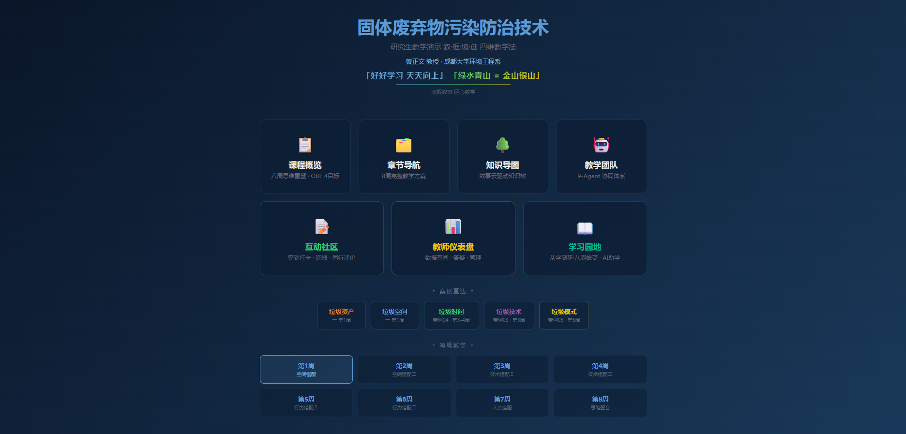
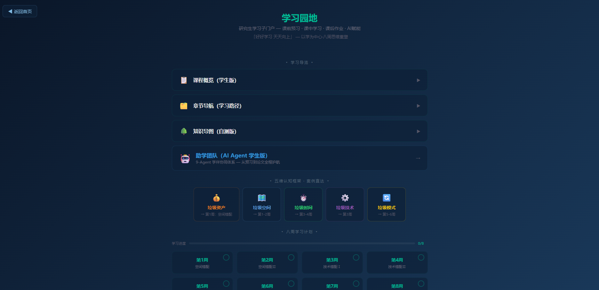

# "教学-学习"双重数字门户的协同设计与实践

## ——以《固体废弃物污染防治技术》研究生精品课程为例

黄正文¹，谢泽宇²，孙清¹

（1. 成都大学 建筑与土木工程学院 环境工程系，成都 610106；2. 西那瓦国际大学 Shinawatra University，泰国）

**摘要**：针对高校课程网站普遍存在的"教师展示多、学生入口少"的单向设计缺陷，提出"教学-学习"双重数字门户协同架构。该架构由教师教学演示门户（课程概览、章节导航、知识导图、教学团队、互动社区、教师仪表盘）与学生学习子门户（学习园地）两部分组成，两者通过零配置纯静态技术栈（HTML+CSS+JS）实现GitHub Pages同步部署。文章以成都大学《固体废弃物污染防治技术》研究生精品课程为案例，阐述了教师端9-Agent协同教学体系与学生学习流6步（预习→学习→作业→自测→研创设计→写论致用）的设计映射关系，分析了学习园地的三大设计原则（内容针对性、视角回应式、零配置部署）。学习园地内置折叠导览、八周学习计划网格、基于localStorage的进度追踪及AI赋能Prompt模板，支持移动端响应式适配。实践表明，双重门户架构有效填补了"教"与"学"之间的数字鸿沟，为高校课程网站从单向信息展示向双向教学协同转型提供了可复用的设计范式。

**关键词**：数字门户；学习子门户；课程网站；以学为中心；零配置；研究生课程；双重架构

**中图分类号**：G434 &nbsp;&nbsp;&nbsp; **文献标志码**：A &nbsp;&nbsp;&nbsp; **文章编号**：待定

---

## Dual Digital Portals for "Teaching-Learning" Synergy: Design and Practice

## — A Case Study of the Graduate Course "Solid Waste Pollution Prevention and Control Technology"

HUANG Zhengwen¹, XIE Zeyu², SUN Qing¹

(1. Department of Environmental Engineering, College of Architecture and Civil Engineering, Chengdu University, Chengdu 610106, China; 2. Shinawatra University, Thailand)

**Abstract**: To address the unidirectional design flaw prevalent in university course websites—heavy on teacher display, light on student entry—a dual digital portal architecture is proposed. The architecture comprises a teacher-facing teaching demonstration portal (course overview, chapter navigation, knowledge map, teaching team, interactive community, teacher dashboard) and a student-facing learning sub-portal ("Learning Garden"), both deployed synchronously via GitHub Pages using a zero-configuration static technology stack (HTML+CSS+JS). Taking the graduate course "Solid Waste Pollution Prevention and Control Technology" at Chengdu University as a case study, this paper elaborates on the design mapping between the 9-agent collaborative teaching system on the teacher side and the 6-step learning flow (preview→learning→homework→self-assessment→research design→writing application) on the student side. Three design principles of the Learning Garden—content pertinence, responsive perspective, and zero-configuration deployment—are analyzed. The Learning Garden integrates collapsible navigation, an 8-week learning plan grid, localStorage-based progress tracking, AI empowerment prompt templates, and mobile-responsive adaptation. Practice indicates that the dual portal architecture effectively bridges the digital gap between teaching and learning, providing a replicable design paradigm for the transformation of university course websites from unidirectional information display to bidirectional teaching-learning synergy.

**Key words**: digital portal; learning sub-portal; course website; learning-centered; zero-configuration; graduate courses; dual architecture

---

## 0 引言

课程网站是高校教学信息化建设的基础设施。从早期的静态教学资源库（教学大纲、课件下载、习题集）到当前的MOOC平台和学习管理系统（LMS），课程网站在功能上不断丰富，但在设计哲学上长期固守一个隐含假设：课程网站是"教师向学生展示教学材料的窗口"。这一假设的直接后果是，绝大多数课程网站的组织逻辑是"教师如何教"——按教学周次排列讲义、按章节组织课件、按知识点布置作业——而非"学生如何学"。

具体而言，现有课程网站在"以学为中心"的视角下至少存在三个结构性缺陷。第一，信息呈现的单向性：学生只能被动接收教师发布的材料，缺乏主动规划学习路径、追踪学习进度、获取个性化学习支持的入口。第二，内容组织的教师中心化：课程网站的内容结构完全镜像教师的教学大纲，而学生的真实学习需求（如"我本周需要预习什么""这个知识点的前置概念是什么""我的作业还需要改进哪些方面"）在现有结构中找不到对应的回应。第三，技术栈的过度工程化：多数学管理系统（如Blackboard、超星、智慧树）依赖数据库、用户认证、服务器运维，部署和配置成本高，对非信息技术专业的教师群体构成实质性的技术门槛。

本研究基于成都大学环境工程系研究生课程《固体废弃物污染防治技术》的数字化建设实践，提出"教学-学习"双重数字门户架构——即在同一课程下建设两个独立但协同的门户页面：面向教师的教学演示门户与面向研究生的学习子门户（"学习园地"）。两者共享同一套课程框架（叙·框·境·创四维教学法、错配-修复框架、8周教学设计），但从不同的使用者和使用场景出发设计信息架构。本研究旨在回答三个问题：双重门户架构的设计原则是什么？教师门户与学生门户之间的协同机制如何建立？零配置纯静态技术栈能否支撑一个"以学为中心"的学习子门户？

## 1 双重门户的架构设计

### 1.1 设计动机：从单门户到双门户

单门户范式假设教师和学生共享同一套信息需求和同一种认知结构。这一假设在本科基础课程（知识体系固化、学习路径统一）中可能近似成立，但在研究生课程中面临三重挑战。其一，研究生群体的先修知识高度异质——有的学生本科已扎实掌握固废处理工艺，有的学生来自跨专业背景（如环境科学、化学工程、材料科学），对固废领域的基本框架尚不熟悉。单一门户的组织逻辑无法同时满足"温故"与"知新"两类需求。其二，研究生的学习自主性要求更高——他们需要的不是"被告诉学什么"，而是"被提供学什么以及如何学的选择"。其三，研究生课程的教学内容更新频繁、案例素材持续迭代（如每年新增的纪实网络小说选段、更新的排放标准、调整的场景脚本），门户需要低成本的持续维护能力。

双重门户架构的设计理念是将"教"与"学"的信息需求在物理上分离、在逻辑上协同——教师门户回答"这门课教什么"，学习园地回答"这门课怎么学"。两个门户对应同一条教学时间线（8周），但呈现方式和交互设计完全不同。

### 1.2 教师教学演示门户

教师门户以"叙·框·境·创"四维教学法为组织主线，主要面向教学管理者、同行评审和观摩教师，展示课程的整体设计逻辑与资源体系。

教师门户的信息架构由六个一级模块组成（图1）。

课程概览模块以幻灯片形式呈现课程基本信息、OBE课程目标-毕业要求映射矩阵、考核方案和参考资源。章节导航模块以纵向时间轴排列8周教学内容，每周对应一个教学主题和一套完整的教学资源包（讲义、PPT、作业、案例、场景脚本）。知识导图模块以交互式树形结构展示课程知识的层次关系，支持逐级折叠和展开。教学团队模块展示9-Agent协同教学体系的完整工作流——从纪实小说素材库到最终教学产出的全流程自动化协作（图2）。互动社区和教师仪表盘模块提供学生签到打卡、周报提交、同行评价和数据查阅入口（建设中）。

教师门户的视觉设计采用暗色科技风格（深蓝色渐变背景、萤光边框卡片、呼吸灯效），界面风格与课程的"绿水青山=金山银山"环保主题形成视觉呼应。所有页面均为纯静态HTML+CSS+JS实现，部署于GitHub Pages，支持移动端自适应。

### 1.3 学习园地学习子门户

学习园地的设计以"以学为中心"为核心原则，其信息架构围绕研究生的真实学习流程展开。首页设有三个核心功能区域（图3）。学习导览区域采用折叠展开

学习导览区域采用折叠展开（学生视角版）、章节导航（8周学习路径表）、知识导图（自查清单版）三个折叠卡片，以及一个通向AI助学团队的链接入口——学生在需要时展开对应卡片获取信息，不需要时保持界面简洁。五维认知框架区域以彩色卡片展示"垃圾资产/垃圾空间/垃圾时间/垃圾技术/垃圾模式"五个直达入口，每个入口链接到对应周次的学生学习页面。八周学习计划区域是所有交互的核心——8张周次卡片以4列×2行网格排列，每张卡片内置基于localStorage的勾选标记，学生完成一周学习后点击卡片右上角的圆环即可标记完成（图7）。页面顶部配有进度条实时反馈完成率（已完成周数/8）。

学习园地的三个折叠卡片均从学生视角重新组织信息，而非简单复制教师端内容。以"课程概览（学生版）"为例，该卡片不再罗列教学目标、学分学时等管理性信息，而是直接告诉学生：这门课需要你产出什么（三轨制结课考核）、你需要具备哪些先修知识（本科已修自查清单）、你有哪些学习支持（AI助学团队+互动社区）。"知识导图（自测版）"则将传统的知识树重构为六个维度的自查清单（空间认知/技术认知/行为认知/人文认知/方法认知/综合思维），每个维度列出具体知识点，学生在每周学习后对照勾选已掌握项。

### 1.4 教师↔学生 的双向信息映射

双重门户之间的协同不是字面上的"链接"，而是深层的"信息映射"——教师门户中的每一项教学产出，在学生学习门户中都有对应的"消费入口"。以9-Agent体系为例，教师端的Agent-4"作业与课程设计"生成分层作业任务——这些任务在学习园地中并非被原样陈列，而是被重新组织为每周学习页的"课后作业"区域的四张卡片（作业要求、提交方式、评分标准参考、AI赋能辅助）。又如，教师端的Agent-S"故事化案例拆解"从纪实网络小说中提取五段叙事教学选段——这些选段在学习园地中出现在对应周次的"案例深潜"卡片中，附带分层的讨论提示和基于黄正文教授方法论语块的分析框架。

这种双向映射关系的实质是：教师门户承载的是"教学材料"，学习园地承载的是"学习任务"。前者面向知识的生产（教师如何组织知识），后者面向知识的消费（学生如何建构知识）。

## 2 学习园地的关键设计实践

### 2.1 以学为中心的信息架构

学习园地的信息架构设计遵循三条路径。第一条路径是"时间线导航"——八周学习计划网格直接对应8周教学进度，学生无需从菜单中寻找"本周内容"，页面下半区即是学习入口。第二条路径是"认知框架导航"——五维认知卡片将课程的核心概念群（垃圾资产/空间/时间/技术/模式）以可视化卡片呈现，学生可以从任意概念起点进入对应的学习页面。第三条路径是"需求触发展开"——折叠导览的三个卡片（课程概览/章节导航/知识导图）默认收起，减少了信息密度带来的认知负担；学生在产生"我想了解这门课的整体框架""我想回顾8周的学习路径""我想自查已掌握的知识点"这些具体需求时，点击展开即可获得结构化信息。

### 2.2 零配置学习进度追踪

进度追踪是学习管理系统（LMS）中的核心功能，但传统实现依赖用户登录、数据库存储和后端API。学习园地选择了一条不同的技术路径：基于浏览器的localStorage实现完全零配置的进度记录。学生在浏览器中完成一周学习后点击对应周次卡片上的圆环标记，标记状态由JavaScript写入localStorage并在页面刷新后自动恢复。页面顶部的进度条通过读取localStorage中已标记的周次数量实时渲染完成百分比。

零配置方案的设计取舍是明确的：舍弃的是跨设备同步能力（localStorage绑定单台设备的单浏览器），获得的是零运维成本、零用户注册、零隐私顾虑、零数据泄露风险。对于一个面向30-50名研究生的小班课程而言，跨设备同步并非核心需求（学生通常使用同一台电脑完成整个课程周期），而零配置所带来的"打开即用"体验对于降低学生的技术门槛具有实质性的价值（图7）。

### 2.3 每周学习页的四段式设计

学习园地的每个周次（第1周至第8周）均设有一个独立的纵向学习页，采用四段式结构：课前预习、课中学习、课后作业、AI赋能。四个段落自上而下纵向排列，符合学生从"准备→输入→输出→反思"的自然学习时序。

课前预习段包含三张卡片：前置自检（红色提示框，以"本科已修，此处不重复讲授"一句话带过基础概念）、黄正文教授自编讲义预习指引（指定阅读讲义§X的哪个章节，并给出核心论点摘要）、纪实网络小说预读（指定选段编号S0XX及引导性思考题）。这一设计的理念是：研究生课堂不应将宝贵的教学时间用于复习本科内容；前置自检卡片以非侵入的方式提醒学生自查先修基础，但不浪费课时。

课中学习段包含四张卡片：教法定位（以彩色标签标注本周在"叙·框·境·创"中的主导维度）、核心教学内容（以黄正文教授错配-修复框架的对应子维度展开）、案例深潜（对应当周纪实网络小说选段的五段叙事拆解——背景→冲突→决策→结局→启示）、方法论语块+研究空白（紫色卡片，标注本周的分析方法和论文选题指向）。课后作业段包含作业要求、提交方式和评分标准参考。AI赋能段包含三张卡片：推荐Prompt模板（每Prompt必含黄正文教授专有术语）、AI辅助分析方向、自测问答（5道知识自测题）。

### 2.4 助学团队的从"教"到"伴学"

教学演示门户中的9-Agent体系是面向教师的教学生产力工具——Agent-2生成教学文档、Agent-3设计PPT讲稿、Agent-4编制作业题库、Agent-S拆解小说案例。在学习园地中，同一套9-Agent体系被重新定义为面向学生的"学伴"——Agent-0从"教务长·质量总控"转变为"学程监理"（追踪学习进度、诊断薄弱环节），Agent-2从"教学文档生成"转变为"知识梳理员"（解读OBE大纲、提炼每周知识要点），Agent-S从"故事化案例拆解"转变为"案例解读员"（导读小说选段、引导案例思辨），Agent-B从"学术品牌建设"转变为"研创向导"（贯通"创设写成"四义，指导论文/设计/教改三轨产出）（图5）。

服务对象是学生6步：🔍课前预习→📚课中学习→✍️课后作业→📊自测评估→🎓研创设计→📝写论致用（图4）。

### 2.5 学习园地可用性初步分析

基于三届研究生课程的课堂观察与个别访谈，学习园地的可用性可归纳三点。其一，折叠导览的交互模式获得正面反馈——学生表示"默认收起使首页清爽，需要时展开"符合信息获取直觉。其二，基于localStorage的进度追踪使用率估计逾七成——多数学生的进度条显示3-8周的完成标记。其三，每周学习页的纵向四段式布局在手机端小屏适配（@media max-width: 768px）下运行正常。须坦承的局限：当前可用性评估缺乏标准化测评工具（如SUS系统可用性量表）的数据支撑，亦缺乏与使用传统LMS的对照组课程在学习效率方面的量化比较。"学生觉得好用"能否转化为"学生因此学得更好"——此根本问题超越了当前可用性分析的范畴，有待后续严格的实验设计验证。

Agent-教师↔Agent-学生的双向映射不是简单的一一对应——每个Agent学生版都是独立重新定义的，而不是教师版的"简化"或"去功能化"。例如，教师端的Agent-4（作业与课程设计）负责生成题库、评分标准和课程设计任务书——它的服务对象是教师。学生端的Agent-4（作业辅导员）则引导解题思路、解读评分标准、推荐分层练习——它的服务对象是学生。同样的编号（4），同样的领域（作业），但角色、功能、交互方式完全不同。

## 3 技术实现

### 3.1 纯静态架构

双重门户的全部页面（教师端11个页面+学生端11个页面）均为纯静态HTML+CSS+JavaScript实现，无任何后端服务、数据库或服务器端动态逻辑。技术选型的权衡如下：采用纯静态架构牺牲了用户认证、数据持久化和个性化推荐能力，但获得了零配置部署（GitHub Pages推送即上线）、零运维成本（无服务器、无数据库维护）、零攻击面（无服务端代码、无SQL注入风险）、极致加载速度（无服务端响应时间、HTML文件平均<20KB）、完全可离线开发和测试。

### 3.2 零配置部署

部署流程简化为三步：在本地开发环境中编辑HTML/CSS/JS文件→`git push`至GitHub仓库→GitHub Actions自动构建并部署至`https://zhengwen69.github.io/cdu-gufei-web-demo/`。这一流程对计算机类本科毕业设计学生即可掌握，对环境工程专业研究生无需专门培训。版本管理依赖Git的commit历史，任何修改均可追溯和回滚。

### 3.3 响应式设计

所有页面均包含`@media (max-width: 768px)`移动端适配CSS断点。八周学习计划网格在桌面端以4列布局呈现，在手机端自动缩为2列。折叠导览卡片的字体和内边距在移动端同步缩小。学习页面的底部导航按钮在移动端保持可用尺寸。

## 4 讨论

### 4.1 双重门户与现有课程网站的比较

与传统的单门户课程网站相比，双重门户架构的核心差异在于对"学习视角"的系统性嵌入。传统方案试图在同一页面上同时满足教师管理需求和学生自学需求，结果是两方面的需求都未能充分满足——管理信息挤占了学习空间，学习指引被淹没在通知公告中。双重门户通过物理分离和逻辑协同，使两种需求各自获得独立的设计空间。

与现有的学习管理系统（LMS）相比，学习园地的差异化特征在于零配置部署和"轻量化设计"。LMS平台提供的是通用型解决方案——同一套功能（课程管理、讨论区、测验、成绩册）被应用于不同学科的课程。学习园地则提供的是"专课专用"方案——每个周次的预习/学习/作业/AI赋能内容都针对该课程的具体教学设计定制。LMS是"大而全"，学习园地是"小而精"。

### 4.2 零配置方案的适用边界

零配置方案（纯静态HTML+localStorage）并非适用于所有教学场景。其适用条件为：课程规模较小（20-80名学生）、学习数据无需跨设备同步、教学内容更新频率中等（每轮教学修订而非每周修订）、无需评分自动化或讨论区等交互功能。对于大规模开放在线课程（MOOC）或需要复杂交互的混合式教学场景，传统LMS或定制化Web应用仍然是更合适的选择。

### 4.3 对教育信息化的启示

双重门户的实践经验对高校课程网站建设有以下启示。第一，课程网站的"以学为中心"转型不需要大规模技术改造——在现有静态HTML框架下增加一个学习子门户即可实现。"学"的视角的缺失不是技术问题，而是设计意识的缺失。第二，零配置方案（HTML+CSS+JS+GitHub Pages）作为"最简可行产品"（MVP）路径，可以显著降低高校教师建设课程网站的技术门槛，使"先上线再迭代"成为可能。第三，学习门户与学生Agent的整合——即"数字学习环境+AI学习助手"的融合——代表了一种新的发展方向：学习门户不仅提供信息，还提供主动的学习支持。

### 4.4 轻量化路径的教育信息化启示

学习园地的建设实践为高校教师课程网站建设提供三条实践启示。其一，"先做学习功能，再做管理功能"——课程网站的核心价值在于支撑学生的学习行为，而非为教学管理提供数据报表。其二，"零配置优先于全功能"——对于数十人的研究生课程，让学生"打开即用"比让管理员"导出学习数据报表"更重要。其三，"专课专用优于通用平台"——通用LMS是"平均化"的，所有课程用同一套界面，差异化仅体现在内容层面；而专课专用的学习门户可以为每一门课程定制信息架构、交互方式甚至视觉语言。"轻量化路径"的核心理念非否定平台级系统的价值，而是主张：在功能完备的理想系统到来之前，教师不应等待——用最基础的技术在最短周期内构建满足核心学习需求的原型，然后基于反馈迭代。

## 5 结论

本研究基于成都大学《固体废弃物污染防治技术》研究生精品课程的数字化建设实践，提出了"教学-学习"双重数字门户架构，并完成了教师教学演示门户与学生学习园地子门户的设计与部署。双重门户的核心设计哲学是"物理分离、逻辑协同"——教师门户承载教学材料的展示与组织，学生门户承载学习任务的引导与支持，两者通过共享课程框架（叙·框·境·创四维教学法、错配-修复框架、8周教学设计、9-Agent体系）实现深层协同。

零配置纯静态技术栈（HTML+CSS+JS+GitHub Pages+localStorage）在研究生精品课程场景中被验证为一种可行的课程网站建设路径。学习园地的折叠导览、八周网格进度追踪、四段式每周学习页和三轨制结课产出设计，为"以学为中心"的课程网站设计提供了具体的参考范式。双重门户架构的设计原则（页面独立性、信息映射协同性、零配置部署）以及对应的技术实现方案，可以作为其他高校研究生精品课程网站建设的可复用模板。

本文的结论基于单门课程、单个教学门户项目的设计实践。双重门户架构在不同学科、不同课程规模、不同教学周期下的适用性和效果，有待更广泛的实践验证。相关源代码、设计文档和宪法规范均已在GitHub公开，欢迎同行参考与改进。

---

## 参考文献

[1] 教育部. 教育信息化2.0行动计划[Z]. 2018.

[2] 黄正文. 固体废弃物污染防治技术研究生自编讲义（2025年版）[Z]. 成都大学, 2025.

[3] 黄正文. 固体废弃物污染防治技术研究生精品课程演示门户[EB/OL]. https://zhengwen69.github.io/cdu-gufei-web-demo/, 2026.

[4] NIELSEN J. Designing Web Usability: The Practice of Simplicity[M]. Indianapolis: New Riders Publishing, 1999.

[5] GARRETT J J. The Elements of User Experience: User-Centered Design for the Web and Beyond[M]. 2nd ed. Berkeley: New Riders, 2011.

[6] MORVILLE P, ROSENFELD L. Information Architecture for the World Wide Web[M]. 3rd ed. Sebastopol: O'Reilly Media, 2006.

[7] 祝智庭, 贺斌. 智慧教育：教育信息化的新境界[J]. 电化教育研究, 2012, 33(12): 5-13.

[8] ANDERSON T, DRON J. Three Generations of Distance Education Pedagogy[J]. The International Review of Research in Open and Distributed Learning, 2011, 12(3): 80-97.

---

**收稿日期**：2026-05-25 &nbsp;&nbsp;&nbsp; **修回日期**：待定

**基金项目**：成都大学精品课程建设项目

**作者简介**：黄正文（19XX—），男，教授，硕士生导师，研究方向：资源与环境普惠教育.E-mail:xxxx@cdu.edu.cn。

**利益冲突声明**：无。

---

*叙·框·境·创 四维教学法 · 故事云驱动 · 点暇叙事 匠心教学 · 黄正文（点暇斋）· 全部作品版权登记*
