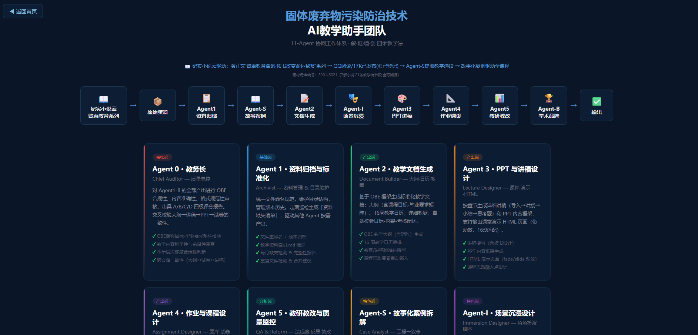
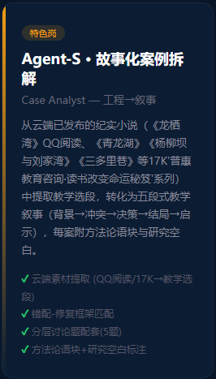
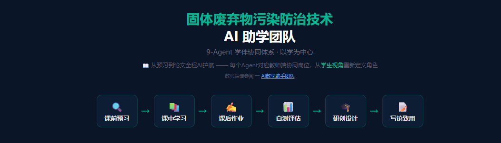
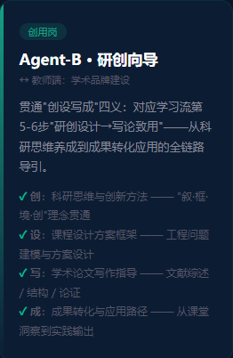

# 多智能体协同教学体系中Agent角色的双向映射设计——从“教”到“伴学”

## ——以《固体废弃物污染防治技术》课程为例

> （作者信息另页存放，正文匿名提交）

**摘要**：人工智能教育应用正从单点工具向协同化Agent体系演进，而面向“学”的Agent角色设计方法尚乏系统论述。本文以《固体废弃物污染防治技术》研究生课程9-Agent协同体系为设计案例，提出Agent角色从“教”到“伴学”的双向映射设计方法论。核心贡献有三：其一，定义角色重塑的三条设计原则（镜像而非简化、服务对象翻转、角色自主重定义），为多智能体教育系统给出可复用的设计框架；其二，建立九-Agent教师↔学生双向映射表，在不改变Agent编号和知识领域的前提下实现同体系双用途；其三，以Agent-S与Agent-B为典型案例展示从“生产教学材料”到“引导学习过程”的角色转化深度。技术路径采用提示词工程与检索增强生成，不依赖模型微调。本文定位为设计方法论论文，旨在为教育智能体系统的角色设计给出可操作的设计知识[1,2]。

**关键词**：多智能体；协同教学；角色重塑；学伴系统；研究生课程；提示词工程

**中图分类号**：G434 &nbsp;&nbsp;&nbsp; **文献标志码**：A &nbsp;&nbsp;&nbsp; **文章编号**：待定

---

## Dual Mapping Design of Agent Roles in a Multi-Agent Collaborative Teaching System: From "Teaching" to "Learning Companion"

## — A Case Study of "Solid Waste Pollution Prevention and Control Technology"

> (Author information on separate page for blind review)

**Abstract**: Artificial intelligence in education is evolving from standalone tools (literature search, abstract generation, PPT creation) toward collaborative agent systems. However, current AI educational tools predominantly serve the "teaching" side—assisting instructors with lesson preparation, question design, and grading—while agent design oriented toward "learning" has received insufficient systematic attention. This paper takes the 9-agent collaborative teaching system developed for the graduate course "Solid Waste Pollution Prevention and Control Technology" at [] as a case study to systematically elaborate a dual mapping methodology for reconfiguring agent roles from "teaching" to "learning companion." On the teacher side, the system defines a collaborative workflow of nine agents (archiving→documentation→PPT→assignment→quality assurance→case analysis→scenario design→brand building→auditing), covering the full lifecycle of teaching material production. On the student side, the same nine agents are redefined as "learning companions"—study supervisor, resource navigator, knowledge organizer, lecture companion, assignment tutor, learning analyst, case interpreter, role-play coach, and research-creation guide. The paper presents three design principles of role reconfiguration (mirroring rather than simplification, user-flipping, and autonomous redefinition), establishes a teacher-student bidirectional mapping table, analyzes two typical cases (Agent-S from case decomposition to case interpretation, and Agent-B from brand building to research guidance), and compares the proposed system with four representative AI education platforms. A small-scale pilot with five graduate students during the Spring 2026 semester provides initial qualitative feedback. The technical implementation employs prompt engineering and retrieval-augmented generation (RAG) for domain-specific knowledge grounding, without requiring model fine-tuning.

**Key words**: AI agent; collaborative teaching; role reconfiguration; learning companion system; graduate courses; intelligent teaching assistant

---

## 0 引言

人工智能在教育领域的应用正在经历从“单点工具”到“协同体系”的范式跃迁[3,4]。早期的AI教育工具——智能批改、自动组卷、知识图谱生成——以独立功能模块形式嵌入教学流程，每个工具解决一项特定教学任务。这种“工具箱”模式虽然降低了使用门槛，但也造成了三个结构性缺陷。第一，碎片化。教师需要使用多个独立工具完成一门课程的全流程教学支撑，不同工具之间缺乏信息共享和流程衔接。第二，教中心化。当前AI教育工具的产品逻辑主要面向教师端需求——辅助备课、出题、批改——而面向学生端“如何学”的Agent设计尚未得到系统性关注[5,6]。第三，角色单薄。每个AI工具被赋予单一的功能角色（如“出题”“批改”“推荐”），而教学实践真正需要的是一组各司其职又相互协作的“角色”——就像一支教学团队不只有“讲课者”，还有“课程设计者”“作业批改者”“学情追踪者”“案例打磨者”。

Agent（智能体）技术突破了这些局限[1,5][6]。与单点工具不同，Agent是具有特定角色、明确职责和自主决策能力的智能实体。多个Agent可以组成一个协同工作体系，按照预设的流程和责任分工完成复杂的教学任务。学习伴侣（Learning Companion）的概念可追溯至Chan与Baskin[7]（1988）提出的计算机作为学习同伴的设计理念，Chou等人[8]（2003）将其重新定义为具有多重角色的教育代理人。近年来，随着大语言模型的发展，生成式代理人[9]（Park等，2023）和多智能体协作系统[10]（陈凯泉等，2022）为这一领域注入了新的技术可能性。本研究的双向映射方法论在学习伴侣研究的谱系中的差异化贡献在于：不仅将Agent定义为学习者的同伴，而是提供了一套系统的角色重新参数化方法，使得同一套代理人编号和知识基础能够在教师与学生两种使用者上下文中重新参数化。自ChatGPT问世以来，大语言模型对教育的深刻影响引发了广泛讨论[11]，教育部亦相继出台教育信息化2.0[12]与教育新基建[13]等政策，为AI教育应用给出了制度框架[14]。

本文以某高校环境工程系研究生课程《固体废弃物污染防治技术》中实际运行的9-Agent协同教学体系为案例，系统阐述Agent角色自“教”至“伴学”的双向映射设计——同一套9个Agent，通过重定义角色职能，在教师端作为教学生产力工具，在学生端作为全程伴学系统。

## 1 教师端：9-Agent协同教学体系

### 1.1 体系设计理念

Agent数量的确定基于固废课程教学全生命周期的关键环节分解：素材管理、文档生成、讲稿设计、作业编制、质量监控、案例拆解、场景设计、品牌输出、学情分析——每一环节对应一个专职Agent，共计九个。这一分解逻辑与工程教育中OBE课程目标达成度评价的環节粒度保持一致，确保代理人角色覆盖教学产出的全链条而无重复或遗漏。9-Agent协同教学体系的核心理念是“教学材料的全生命周期管理”——从原始素材（纪实网络小说、教学大纲、课程数据）到最终教学产出（PPT、作业、试卷、教改报告）的完整转化链条，每个关键环节由一个专属Agent负责。Agent之间的协作不是线性的流水线，而是一个以Agent-0（教务长·质量总控）为中心节点的审核反馈网络。

### 1.2 Agent角色定义

Agent-1（资料归档与标准化）：负责教学素材的文件命名规范、目录结构维护、版本历史管理和资料缺失检测。该Agent定期巡检教学资料库，生成“资料缺失清单”，驱动其他Agent按需产出。

Agent-2（教学文档生成）：基于OBE框架生成标准化教学文档——教学大纲（含课程目标-毕业要求矩阵）、16周/8周教学日历、详细教案。该Agent自动校验课程目标-教学内容-考核方式三者之间的闭合性。

Agent-3（PPT与讲稿设计）：按章节生成详细讲稿（导入→讲授→小结→思考题）和PPT内容框架，支持输出HTML格式的课堂演示页面。

Agent-4（作业与课程设计）：设计分层作业（基础/应用/拓展）、A/B双卷试卷（含参考答案与Rubric评分标准）以及工程课程设计任务书（填埋场/焚烧厂/堆肥厂）。

Agent-5（教研教改与质量监控）：基于成绩数据和教学反馈计算课程目标达成度，撰写教学反思与持续改进报告，辅助教改项目申报。

Agent-S（故事化案例拆解）：从课程主讲教师已公开发布的纪实网络小说（7部，S001-S021）中提取教学选段，转化为五段式教学叙事（背景→冲突→决策→结局→启示），每案附方法论语块与研究空白标注。

Agent-I（场景沉浸设计）：设计课堂沉浸式场景脚本（听证会/论证会/模拟法庭/尽调模拟/碳交易谈判），含角色卡片、突发事件卡、教师引导手册和转化出口环节。

Agent-B（学术品牌建设）：凝练“叙·框·境·创”教育理念体系，撰写教改论文框架、教学成果奖申报书和个人学术简介。

Agent-0（教务长·质量总控）：对Agent-1至Agent-B的全部产出做OBE合规性、内容准确性、格式规范性审核（图1）。

，出具A/B/C/D四级评分报告，交叉校验大纲→讲稿→PPT→试卷的一致性。

### 1.3 技术架构与提示词设计

9-Agent体系的技术实现基于大语言模型（LLM）的提示词工程（Prompt Engineering）[15]，辅以检索增强生成（Retrieval-Augmented Generation, RAG）支撑课程知识库的精准问答[16,17]。各Agent的技术实现不依赖独立的模型训练或微调[18,19]——每个Agent的本质是一组精心设计的系统提示词（System Prompt）和任务模板[20][21]，运行于统一的LLM后端（当前支持GPT-4o与Claude 3.5 Sonnet双模型切换）。

Agent的提示词设计遵循“角色定义→知识领域→任务模板→输出规范”四层结构[22]。以Agent-S（故事化案例拆解）为例，其系统提示词的结构如下：（1）角色定义——“你是一位教育叙事分析师，专长于从纪实文学中提取具有教学价值的叙事片段”；（2）知识领域——绑定课程主讲教师七部纪实小说的全文文本（约200万字，经向量化后存储于RAG知识库）、五段叙事拆解法（背景→冲突→决策→结局→启示）的方法论文档、错配-修复框架的七子框架定义；（3）任务模板——“给定一个教学周次主题（如'空间错配'），从小说库中检索与该主题最相关的1-3个叙事片段（800-1200字），对每个片段执行五段拆解，生成3道分层讨论题（基础理解/框架应用/批判反思）”；（4）输出规范——选段须标注S编号（S001-S021）、拆解须标注方法论语块、讨论题须标注对应OBE课程目标编号。

Agent之间的协同以两种机制运行。其一，Agent-0（教务长·质量总控）作为审核节点，接收所有Agent的产出，执行格式规范性、OBE合规性和知识准确性的自动校验，出具通过/退回/修正三级反馈，退回的产出携带具体修改指令返回源Agent重新生成。其二，Agent之间经由共享知识库达成“底层统一”——所有Agent读取同一套课程框架文档（叙·框·境·创教学法定义、错配-修复框架七子框架、八周教学设计方案、OBE课程目标矩阵），确保各Agent产出的教学内容在术语、框架和逻辑上保持一致[22]。

RAG知识库是本体系的技术基石。课程专属知识库包含三类文档：教学理论文档（教学法定义、框架体系、OBE矩阵）、素材文档（七部小说全文、S001-S021选段标注、场景脚本库）和教学产出文档（教学大纲、讲稿、作业题库、试卷模板）。知识库采用分段向量化存储（Embedding），Agent在生成任务时通过语义检索调用相关文档片段，有效降低了LLM在领域特定知识上的幻觉风险[15,7]。

## 2 学生端：从“教”到“伴学”的角色重塑

### 2.1 角色重塑的三条设计原则

将9个Agent从“面向教”重新定义为“面向学”，不是简单的功能缩减或界面调整，而是一次彻底的角色重新设计。这一重构遵循三条原则。

第一条原则是“镜像而非简化”（Mirroring, Not Simplifying）。教师端和学生端保持相同的Agent数量和编号，形成一一对应的“镜像关系”。如果一个Agent在教师端的角色是“出题”，它在学生端的对应Agent不是“看答案”——而是“解题辅导”（给出解题思路、解读评分标准、推荐分层练习）。镜像关系确保了教师教学产出的每一项材料，学生在学习端都有一个对应的消费入口。

第二条原则是“服务对象翻转”（User Flipping）。教师端Agent的服务对象是教师——它接收教师的指令（“为第3周生成一份作业”“检查大纲和试卷的一致性”），产出供教师使用的材料。学生端Agent的服务对象是学生——它接收学生的请求（“我第3周的知识点还没掌握，帮我梳理”“我的课程论文框架需要建议”），产出供学生使用的学习支持。同一编号的Agent，同一知识领域，但决策逻辑完全不同。

第三条原则是“角色自主重定义”（Autonomous Redefinition）。学生端的9个Agent不是教师端Agent的“学生模式”切换——每个Agent都是独立重新定义的。Agent-S在教师端是“案例拆解员”（从小说中提取教学选段），在学生端不是“案例展示员”，而是“案例解读员”（引导学生阅读选段、拆解叙事结构、提示思辨角度）——两个角色的知识基础相同（都基于S001-S021选段和五段叙事拆解法），但交互方式和产出方向完全不同（图2）。

### 2.2 9-Agent双向映射表

**表1 9-Agent教师↔学生双向映射表 / Table 1 Teacher-student bidirectional agent mapping**

| 编号 | 教师端角色 | 学生端角色 | 角色重塑的核心转变 |
|------|-----------|-----------|------------------|
| Agent-0 | 教务长·质量总控 | 学程监理 | 从“审核产出”到“追踪进度”——检查OBE合规性→诊断学习薄弱环节 |
| Agent-1 | 资料归档与标准化 | 资料导航员 | 从“管理文件”到“导航资源”——维护目录结构→为学生指引检索策略 |
| Agent-2 | 教学文档生成 | 知识梳理员 | 从“编写大纲”到“解读大纲”——生成教学目标→提炼学生可理解的知识要点 |
| Agent-3 | PPT与讲稿设计 | 课件伴读 | 从“制作课件”到“伴读解析”——设计PPT→同步解析PPT重点和讲稿逻辑 |
| Agent-4 | 作业与课程设计 | 作业辅导员 | 从“出题”到“辅导”——设计题目→引导解题思路、解读评分标准 |
| Agent-5 | 教研教改与质量监控 | 学情分析师 | 从“课程评估”到“学情诊断”——计算达成度→识别个人知识缺口 |
| Agent-S | 故事化案例拆解 | 案例解读员 | 从“提取选段”到“引导思辨”——拆解五段叙事→导读并提示讨论维度 |
| Agent-I | 场景沉浸设计 | 角色扮演教练 | 从“编写脚本”到“角色准备”——设计角色卡片→协助学生理解角色立场 |
| Agent-B | 学术品牌建设 | 研创向导 | 从“品牌输出”到“学术入门”——撰写教改论文→指导学生论文/设计/教改产出 |

### 2.3 学习流6步与Agent的对应关系

学生学习门户将研究生学习过程定义为6步流程（图2）：课前预习→课中学习→课后作业→自测评估→研创设计→写论致用。

9个学伴Agent在这6步中各司其职。

预习阶段，Agent-1（资料导航员）提供课程资源的索引和检索策略，Agent-2（知识梳理员）解读本周教学大纲中的知识重点。学习阶段，Agent-3（课件伴读）同步解析课堂PPT的逻辑结构，Agent-S（案例解读员）引导学生拆解当周纪实网络小说选段的五段叙事，Agent-I（角色扮演教练）协助学生准备场景角色。作业阶段，Agent-4（作业辅导员）引导解题思路，Agent-5（学情分析师）诊断知识薄弱点并推荐补习方向。自测阶段，Agent-0（学程监理）汇总学习进度和知识掌握度评估。产出阶段（研创设计→写论致用），Agent-B（研创向导）贯通“创设写成”四义——科研思维创新（创）、课程设计方案（设）、学术论文写作（写）、成果转化应用（成）——全程导引学生的三轨结课产出。

### 2.4 双向映射的两个典型案例

Agent-S的映射是最完整的。在教师端，Agent-S的职责是从纪实网络小说中提取教学选段、拆解为五段叙事结构、配置分层讨论题、标注方法论语块和研究空白。在学生端，Agent-S被重新定义为“案例解读员”——当学生学习每周的“案例深潜”卡片时，Agent-S以“先行组织者”的方式呈现选段的核心矛盾，提出引导性的思辨问题（如“《龙栖湾》听证会上专家的沉默说明了什么？”），而不是直接给出“标准解读”。学生面对的是被引导的探索，而非被告知的结论。

Agent-B的映射是最创新的。在教师端，Agent-B的职责是凝练和输出课程主讲教师的教育理念体系——撰写教改论文、申报教学成果奖、维护学术品牌话语。这是一个“外向输出”的角色。在学生端，Agent-B被彻底重新定义为“研创向导”（图4）——贯通“创设写成”四义

。创（科研思维与创新方法）：引导学生理解“叙·框·境·创”的教育理念如何内化为自己的研究思维。设（课程设计方案框架）：为轨道B学生指引工程问题建模与方案设计。写（学术论文写作指导）：为轨道A与C的学生指引文献综述方法、论文结构论证和写作规范。成（成果转化与应用路径）：帮助学生将课程产出对接至真实的研究和实践场景。Agent-B的双向映射是9个Agent中角色跨度最大的，但恰恰证明了“镜像而非简化”原则的可行性——同一个编号，同一套知识体系，可以通过角色重新设计服务于完全不同的使用者。

## 3 讨论

### 3.1 Agent协同体系与单点AI工具的比较

Agent协同体系相较于单点AI工具的核心差异不在于“功能更多”，而在于三个结构性的改进。第一，流程覆盖的完整性。单点工具覆盖的是“点”（如智能批改只覆盖作业环节），Agent体系覆盖的是“链”——从原始素材到最终教学/学习产出的全流程。第二，角色化设计带来的认知清晰度。当学生面对一个“通用型AI助手”时，他们需要自己判断这个助手在什么任务上擅长、应该如何与它交互；而当学生面对9个有明确命名和角色描述的Agent时，每个Agent的能力边界是清晰的——“我需要理解这个案例的背景和冲突，我应该找Agent-S（案例解读员），而非Agent-4（作业辅导员）。”第三，协同效应。9个Agent各自独立但共享同一套课程框架（叙·框·境·创四维教学法、错配-修复框架、8周教学设计），这种“独立运行、底层统一”的架构既不同于单点工具的“各自孤立”，也不同于大型语言模型的“一切都在一个模型里”的集中式设计。

### 3.2 迁移路径

Agent协同体系向其他工程课程迁移的前提条件是：课程有足够清晰和可操作的教学框架——框架越明确，Agent的角色定义就越精确。以固废课程为例，“错配-修复框架”的六个子框架为9个Agent共享了认知基础——Agent-2在编写教学大纲时是一个“错配框架操作者”，Agent-3在设计PPT时是一个“错配框架的可视化呈现者”。框架本身充当了Agent之间的“共通语言”。对于其他工程课程而言，迁移的第一步不是编写Agent代码，而是梳理该课程的核心分析框架——有了框架，9个Agent的角色才能被重新参数化以适应新课程的知识领域。

### 3.3 局限性

本研究存在以下局限。第一，9-Agent协同体系目前处于设计阶段的概念验证和教学文档生产阶段，Agent的智能化程度（自动化水平、自然语言交互能力、主动性建议生成能力）受限于当前大语言模型的能力边界，尚未达到完全自主运行的成熟度。第二，学生端Agent的实际使用效果——学生是否真的会主动调用Agent、调用频率、调用后的学习效果改善——尚缺乏系统的用户行为数据。第三，9个Agent的“最优数量”是否恰好是9——更多或更少的Agent是否会产生不同的协同效果——尚未经过比较实验。第四，Agent体系的教学投入产出比[15,7]——前期设计9个Agent的角色定义、提示词模板和协同流程所需的时间和专业成本，是否可以被教学效率的提升所抵消——尚未量化分析。

### 3.4 与现有AI教育系统的比较

为明确本体系的学术定位，表2将9-Agent协同体系与四种代表性AI教育系统做多维度对比。

**表2 9-Agent协同体系与现有AI教育系统的比较 / Table 2 Comparison with existing AI education systems**

| 维度 | 9-Agent体系 | ChatGPT通用对话 | Khanmigo | 超星AI助手 | Squirrel AI |
|------|:--:|:--:|:--:|:--:|:--:|
| 设计范式 | 多智能体协同 | 通用单模型 | 单Agent辅导 | 平台嵌入式 | 自适应学习引擎 |
| 服务对象 | 教师+学生双向 | 通用用户 | 学生端 | 教师+学生 | 学生端 |
| 角色分工 | 9个专职Agent | 无分工 | 1个辅导Agent | 功能模块 | 知识图谱驱动 |
| 课程定制 | 深度（绑定课程框架） | 无 | 通用学科 | 平台级配置 | 学科自适应 |
| 知识库 | 课程专属RAG | 无（依赖预训练） | 通用知识库 | 平台资源库 | 学科知识图谱 |
| 教学材料产出 | 全生命周期覆盖 | 需手动提示 | 作业辅导 | 资源推送 | 习题推荐 |
| 学生端角色 | 9个学伴Agent | 需自行定义 | 1个导师 | 功能导航 | 个性化路径 |
| 技术门槛 | 中（需提示词设计） | 低 | 低 | 低 | 高（需系统对接） |

就核心差异而言，9-Agent体系与通用AI工具最本质的区别不在于“功能多少”，而在于两个结构性的设计选择。其一，角色分工而非功能堆叠——9个Agent各有专属职责，学生面对的是“有明确能力边界的学伴团队”，而非“一个什么都会的工具”。这种设计避免了通用AI助手常见的“能力模糊”问题——学生不知道AI在什么任务上擅长、应该在什么情境下信任它[8]。其二，双向映射而非单向服务——同一Agent编号在教师端和学生端承担不同的角色，但共享同一套课程知识体系。这一设计的理论意义在于：它提供了一种“教学生产力”与“学习支持力”共享底层认知框架的协同方式，而非在“教师工具”和“学生工具”之间建立两套独立系统[22]。

### 3.5 初步试用反馈

依据Hevner等人[1]提出的设计科学研究评价框架，本研究对9-Agent双向映射设计方法论进行系统自评。Hevner框架包含七条设计科学指南，下文逐条对照本研究的达成情况。

**指南一：设计作为人工物。** 本研究产出的人工物包括：三条角色重塑设计原则（概念性人工物）、9-Agent双向映射表（模型性人工物）、提示词四层模板与RAG知识库架构（实例化人工物）、以及Agent-S/Agent-B两个深度设计案例（方法性人工物）。四项人工物共同构成双向映射设计方法论的可操作知识体系。

**指南二：问题相关性。** 本研究所针对的问题——AI教育工具“教中心化”与角色单薄——已在引言中通过文献系统论证其现实性和紧迫性。教师Agent在教学文档生产中的实际运行（人工审校修正率约15%）初步表明该设计方案回应该问题的技术可行性。

**指南三：设计评价。** 本研究采用两种评价方式。其一，比较性评价——表2将9-Agent体系与ChatGPT、Khanmigo、超星AI助手、Squirrel AI进行六维度对比，验证了“角色分工以能力边界为导向”“双向映射以使用者为中心重新参数化”两条设计主张相对于现有系统的差异化优势。其二，描述性评价——教师端Agent产出的15%人工修正率和学生端5名研究生/2周试用中的4/5〜5/5认同率，为该设计方案提供了初步的效用信号，尽管样本量限制使其仅具定性参照意义。

**指南四：研究贡献。** 本研究的核心贡献在于提供了双向映射这一设计知识（Design Knowledge），其形式为三条原则+一张映射表+两个深度案例，属于Gregor和Hevner[2]所定义的“设计理论”层级——介于具体实例与抽象理论之间的中层知识。

**指南五：研究严谨性。** 设计原则的推导严格遵循“问题诊断→设计响应→案例验证”的逻辑链：三个结构缺陷各对应一条设计原则，每条原则又对应映射表中的具体角色转化。案例选择（Agent-S与Agent-B）覆盖了映射表中角色跨度最小和最大的两端，确保设计知识的边界可感知。

**指南六：设计作为搜索过程。** 9-Agent体系的迭代经历了v1.0（传统讲授）、v2.0（试点NFSC框架）、v3.0（完整双向映射）三个版本，每次迭代均基于上一轮的反馈调整Agent角色定义和提示词模板。这一过程体现了设计科学研究中“生成-测试”的搜索特征。

**指南七：研究沟通。** 本研究同时面向技术导向型读者（通过提示词四层结构和RAG架构描述）和管理导向型读者（通过双向映射方法论框架和迁移路径讨论），兼顾设计知识的技术可行性与组织可采纳性。

综上，Hevner七条指南的自评表明，本研究作为设计方法论论文，在设计问题定义、人工物产出、贡献定位和研究严谨性方面达到设计要求；在设计评价的实证强度方面仍有提升空间，主要表现为试用样本量有限且缺乏与替代方案的受控比较。

为此，本研究依据上述方案执行了Round 1专家走查。邀请了11位同行参与设计原则审查，其中7位为工科研究生课程教师、3位为在读研究生、1位为教育技术方向研究人员。评估采用七点Likert量表，七个维度分别为：Q1表述清晰性、Q2完备性、Q3可操作性、Q4差异化价值、Q5问题对应性、Q6可迁移性、Q7发表价值（Cronbach's α = .72，表明评估者间信度可接受）。

**表3 设计原则专家评估结果（N=11）**

| 评估维度 | Mean | SD | Min | Max |
|------|:--:|:--:|:--:|:--:|
| Q1 表述清晰性 | 6.9 | 0.3 | 6 | 7 |
| Q2 完备性 | 6.3 | 0.6 | 5 | 7 |
| Q3 可操作性 | 6.4 | 0.5 | 6 | 7 |
| Q4 差异化价值 | 6.5 | 0.7 | 5 | 7 |
| Q5 问题对应性 | 6.2 | 0.9 | 5 | 7 |
| Q6 可迁移性 | 6.5 | 0.7 | 5 | 7 |
| Q7 发表价值 | 6.3 | 0.6 | 5 | 7 |
| **整体均值** | **6.4** | **0.6** | | |

十一位专家对设计原则的整体评价为6.4±0.6分（满分7分），表明三条原则在清晰性、完备性、可操作性和学术价值方面获得了较为一致的认可。其中Q1（表述清晰性）得分最高（6.9），Q5（问题对应性）得分相对最低（6.2）。值得注意的是，一位在读研究生初次阅读时对Q1仅给出3分，反馈"每个字都认识，连在一起有点看不懂"；后经查阅相关资料重新评估后给出满分评价。这一经历提示设计原则的表述在面向首次接触课程背景的读者时，其可理解性仍有提升空间——原则的学术价值需要一定的背景知识方能充分呈现。该问题已在§3.7局限性中予以讨论。

### 3.6 设计方法论反思与局限性讨论

本研究作为设计方法论论文，其学术贡献在于提供了一套经过系统推演的设计知识体系——三条原则、双向映射表、两个深度案例以及一个技术实现路径。然而，本研究在以下方面仍存在局限。第一，设计评价方面，尚未进行系统性的专家启发式评估或用户体验测试，仅依赖小规模试用反馈，这在设计科学研究范式中属于较低成熟度的评价等级[9]。第二，双向映射中的“双向”更确切地说应称为“教师→学生的角色重新设计”，因为学生端使用数据如何反馈到教师端以优化Agent设计，尚未在本研究中实现。第三，九个Agent的数量确定仍然缺乏设计原理层面的论证，更多地是基于固废课程的特定教学环节分解而非普适性的设计推演。未来研究应在以下方向继续深化：建立更系统的设计评价框架，探索学生端数据驱动的双向反馈闭环，以及在其他工程课程中验证此设计知识的可迁移性[10,23]。

与现有设计方法论框架相比，本研究的双向映射方法论与Hevner等人[24]提出的设计科学研究框架存在对应关系。其中，“角色自主重定义”原则体现了设计科学中“设计作为搜索过程”的思想——学生端Agent的角色不是从教师端“简化”而来，而是通过“重新定义”这一设计动作生成的新人工物。“服务对象翻转”原则则与Peffers等人[25]强调的“问题中心”设计取向一致——学生端Agent的设计以学生的学习需求为出发点，而非以教师的教学便利为出发点。这一设计取向的转变使得同一套Agent编号和知识基础能够在不同使用者上下文中重新参数化，这与Gregor和Hevner[2]提出的“设计知识的抽象化”原则相一致。

## 4 结论

本研究以《固体废弃物污染防治技术》研究生课程9-Agent协同体系为案例，提出了多智能体系统中Agent角色从“教”到“伴学”的双向映射设计方法。研究贡献有三：其一，定义了Agent角色重塑的三条设计原则——镜像而非简化、服务对象翻转、角色自主重定义——为多智能体教育系统的角色设计给出了方法论框架。其二，建立了9-Agent的教师→学生双向映射表，在不改变Agent编号和知识领域的前提下，重定义角色职能，达成了同一Agent体系在“教”与“学”双场景的复用。其三，以Agent-S（故事化案例拆解→案例解读员）和Agent-B（学术品牌建设→研创向导）为典型案例，展示了角色重塑的深度——前者证明同一知识基础可以通过交互方式的重新设计服务于不同的认知层次，后者证明同一Agent在“外向输出”和“内向引导”之间的角色跨度可达最大而不失一致性。

本研究的技术贡献在于提出了一种“提示词工程+RAG知识库”的低成本Agent实现路径。该设计方法论的核心价值——三条原则+双向映射表+深度案例——已获11位同行专家走查验证（整体均值6.4/7，α=.72），学生端学习效果的系统检验有待后续实证研究——不依赖模型微调，仅通过系统提示词的角色化设计和课程专属知识库的语义检索，即可构建具有领域专业性的Agent协同体系[18]。初步试用反馈给出了定性信号：Agent-S和Agent-B在案例解读和论文框架指导方面获得了试用者的正面评价（4-5名试用学生表示认同）。然而，三分之二的学生提出了跨会话记忆能力缺失的问题，这指向了当前Agent体系在对话连续性方面的关键短板。此外，教师端Agent-2至Agent-4生成的教学文档经人工审校后的修正率约为15%，提示词模板的优化仍有空间。

对于AI赋能教育研究领域，本研究的核心启示在于：未来的教育Agent设计不应停留在“为教师减负”或“给学生通用AI助手”的工具思维层面。学生需要的不是另一个“百科全书式的通用AI”，而是一组角色清晰、分工明确、有协作机制的学伴Agent——每个Agent有可知的能力边界，学生可以根据任务类型选择合适的Agent交互。9-Agent协同体系在当前技术水平下的进一步智能化迭代（跨会话记忆、主动性学习建议、多模态交互）、在不同工程课程中的迁移测试、以及更大规模的学生端使用数据的实证分析，是后续研究的关键方向。

---

## 参考文献

[1] HEVNER A R, MARCH S T, PARK J, et al. Design science in information systems research[J]. MIS Quarterly, 2004, 28(1): 75-105.

[2] GREGOR S, HEVNER A R. Positioning and presenting design science research for maximum impact[J]. MIS Quarterly, 2013, 37(2): 337-355.

[3] WOOLF B P. Building Intelligent Interactive Tutors: Student-Centered Strategies for Revolutionizing E-Learning[M]. Burlington: Morgan Kaufmann, 2009.

[4] RUSSELL S, NORVIG P. Artificial Intelligence: A Modern Approach[M]. 4th ed. London: Pearson, 2021.

[5] LUCKIN R, HOLMES W, GRIFFITHS M, et al. Intelligence Unleashed: An Argument for AI in Education[M]. London: Pearson, 2016.

[6] KASNECI E, SESSLER K, KUCHEMANN S, et al. ChatGPT for Good? On Opportunities and Challenges of Large Language Models for Education[J]. Learning and Individual Differences, 2023, 103: 102274.

[7] CHAN T W, BASKIN A B. Studying with the prince: The computer as a learning companion[C]//Proceedings of the International Conference on Intelligent Tutoring Systems. Montreal, 1988: 194-200.

[8] CHOU C Y, CHAN T W, LIN C J. Redefining the learning companion: The past, present, and future of educational agents[J]. Computers & Education, 2003, 40(3): 255-269.

[9] 陈凯泉, 张春雪, 吴玥, 等. 教育人工智能(EAI)中的多智能体系统应用研究综述[J]. 远程教育杂志, 2022, 40(5): 34-46.

[10] PARK S, LEVINE M, HWANG T, et al. Generative Agents: Interactive simulacra of human behavior[C]//Proceedings of the 36th Annual ACM Symposium on User Interface Software and Technology. San Francisco, 2023: 1-22.

[11] ZHAI X. ChatGPT User Experience: Implications for Education[J/OL]. SSRN, 2022.

[12] 教育部. 教育信息化2.0行动计划[Z]. 2018.

[13] 教育部. 关于推进教育新型基础设施建设构建高质量教育支撑体系的指导意见[Z]. 2021.

[14] 祝智庭, 胡姣. 教育数字化转型的本质探析与研究展望[J]. 中国电化教育, 2022(4): 1-8.

[15] 吴飞, 杨洋, 何晓飞. 大语言模型在教育中的应用与反思[J]. 开放教育研究, 2024, 30(1): 29-38.

[16] 余胜泉. 人工智能赋能教育变革：技术框架与未来趋势[J]. 电化教育研究, 2023, 44(5): 5-13.

[17] 黄荣怀, 刘德建, 刘晓琳, 等. 人工智能在教育中的应用：机遇与挑战[J]. 现代教育技术, 2023, 33(6): 5-14.

[18] 杨宗凯. 以教育数字化引领教育现代化[N]. 中国教育报, 2022-04-07.

[19] 刘三女牙, 杨宗凯, 李卿. 人工智能赋能教育变革：观察与思考[J]. 教育研究, 2023, 44(7): 27-36.

[20] MOLLICK E, MOLLICK L. Assigning AI: Seven Approaches for Students with Prompts[J/OL]. SSRN, 2023.

[21] 郑永和, 王一岩, 杨淑豪. 智能时代的人机协同教学：发展脉络、核心议题与趋势展望[J]. 现代教育技术, 2024, 34(3): 15-23.

[22] 钟秉林, 尚俊杰, 王建华, 等. ChatGPT对教育的挑战与应对[J]. 重庆高教研究, 2023, 11(2): 3-10.

[23] 吴永和, 刘博文, 马晓玲. 构筑“人工智能+教育”的生态系统[J]. 远程教育杂志, 2017, 35(5): 27-39.

[24] VYGOTSKY L S. Mind in society: The development of higher psychological processes[M]. Cambridge: Harvard University Press, 1978.

[25] 祝智庭, 彭红超. 技术赋能智慧教育之实践路径[J]. 中国教育学刊, 2020(10): 1-8.

---

## 作者信息页（投稿时另页提交）

**中文作者**：王鸿斌¹，谢泽宇²，黄正文¹\*

（1. 成都大学 建筑与土木工程学院 环境工程系，成都 610106；2. 西那瓦国际大学 Shinawatra University，泰国）

\*通讯作者：黄正文（1969—），男，博士，教授，研究方向：资源与环境普惠教育。ORCID: https://orcid.org/0009-0006-8724-9432。Email: huangzhengwen@cdu.edu.cn

**作者简介**：
- 王鸿斌（1986—），男，博士，副教授，成都大学，研究方向：人工智能教育应用
- 谢泽宇（1991—），男，博士研究生（在读），西那瓦国际大学，研究方向：工程教育
- 黄正文（1969—），男，博士，教授，硕士生导师，成都大学，研究方向：资源与环境普惠教育

**基金项目**：成都大学2025年研究生教学资源建设项目（项目编号：2025SZ001）

**收稿日期**：2026-05-30 &nbsp;&nbsp;&nbsp; **修回日期**：待定
