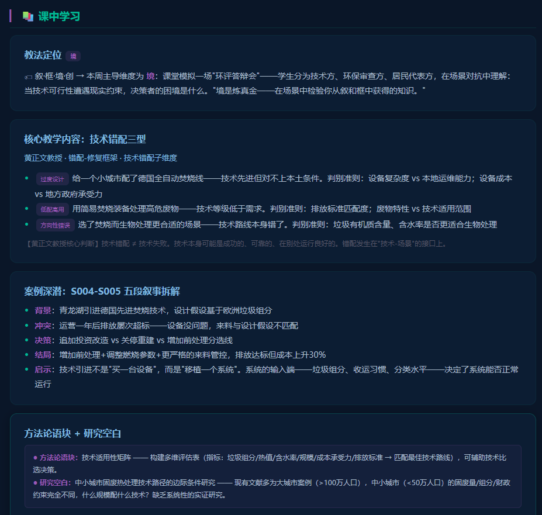

# 纪实小说云驱动——工程案例教学的故事化重构路径

## ——以《固体废弃物污染防治技术》研究生课程为例

黄正文¹，谢泽宇²，王鸿斌¹

（1. 成都大学 建筑与土木工程学院 环境工程系，成都 610106；2. 西那瓦国际大学 Shinawatra University，泰国）

**摘要**：工程案例教学的经典困境是"干案例"——案例被压缩为项目背景（"某市日产垃圾X吨"）+ 技术参数（"拟建焚烧厂Y吨/日"）+ 决策结论（"经论证采用Z工艺"），学生读到的是一份经过高度抽象和事后加工的"无菌报告"，而非一个有温度、有张力、有多维冲突的工程现场。本文以成都大学研究生课程《固体废弃物污染防治技术》的教学实践为案例，提出"纪实小说云驱动"的工程案例故事化重构路径。该路径以黄正文教授已公开发布的七部纪实网络小说（21条教学选段S001-S021）为叙事素材云，通过"五段叙事拆解法"（背景→冲突→决策→结局→启示）将真实固废管理事件转化为可教学的结构化叙事。文章系统呈现了四重错配的叙事化呈现——空间错配（《龙栖湾》的土地贬值）、技术错配（《青龙湖》的技术与来料矛盾）、行为错配（《杨柳坝与刘家湾》的分类困境）、人文错配（《三多里巷》的尊严被忽视）——并分析了"从工程叙事到教学案例"的三步转化路径（提取→拆解→迁移）以及Agent-S（故事化案例拆解Agent）在自动化选段中的协同角色。纪实网络小说作为教学案例素材的独特优势在于：真实性（非虚构，有版权）保障了教学的可信度，叙事性（五段拆解结构）提供了可重复使用的教学语法，增值性（持续创作→持续选段→持续更新）赋予了素材库的生命力。

**关键词**：案例教学；纪实小说；故事化教学；五段叙事；工程教育；研究生课程

**中图分类号**：G642.0 &nbsp;&nbsp;&nbsp; **文献标志码**：A &nbsp;&nbsp;&nbsp; **文章编号**：待定

---

## Documentary Network Novel Cloud-Driven Narrative Reconstruction Pathway for Engineering Case Teaching

## — A Case Study of "Solid Waste Pollution Prevention and Control Technology"

HUANG Zhengwen¹, XIE Zeyu², WANG Hongbin¹

(1. Department of Environmental Engineering, College of Architecture and Civil Engineering, Chengdu University, Chengdu 610106, China; 2. Shinawatra University, Thailand)

**Abstract**: The classic dilemma of engineering case teaching is the "dry case"—cases compressed into project background ("City X generates Y tons of waste daily") plus technical parameters ("proposed incineration plant of Y tons/day") plus decision conclusion ("Process Z adopted after evaluation"). What students read is a highly abstracted, post-hoc "sterile report" rather than a vivid, tension-filled, multi-dimensionally conflicted engineering site. Taking the teaching practice of the graduate course "Solid Waste Pollution Prevention and Control Technology" at Chengdu University as a case study, this paper proposes a "documentary network novel cloud-driven" pathway for the narrative restructuring of engineering case teaching. This pathway employs Professor Huang Zhengwen's seven publicly released documentary network novels (21 teaching excerpts, S001-S021) as a narrative material cloud, transforming real solid waste management events into teachable structured narratives through a "five-stage narrative decomposition method" (background→conflict→decision→outcome→insight). The paper systematically presents the narrative representation of four types of mismatches—spatial mismatch (land devaluation in Longqi Bay), technological mismatch (technology-feedstock contradiction in Qinglong Lake), behavioral mismatch (classification dilemma in Yangliuba and Liujiawan), and humanistic mismatch (dignity neglected in Sanduoli Lane)—and analyzes the three-step transformation pathway from engineering narrative to teaching case (extraction→decomposition→transfer) alongside the collaborative role of Agent-S (story decomposition agent) in automated excerpt selection. The unique advantages of documentary network novels as teaching case material lie in: authenticity (non-fiction, copyright-protected) ensuring pedagogical credibility, narrativity (five-stage decomposition structure) providing a reusable teaching grammar, and generativity (continuous writing→continuous excerpting→continuous updating) endowing the material repository with vitality.

**Key words**: case teaching; documentary novels; narrative pedagogy; five-stage narrative; engineering education; graduate courses

---

## 0 引言

案例教学是工程教育的核心方法之一。一个设计良好的工程案例可以在有限的教学时间内同时达成多重目标：激发学习动机（"这个问题值得解决"）、提供知识锚点（"这个原理在这个场景中是这样用的"）、训练分析能力（"如果是我来决策，我会怎么分析"）以及隐含价值教育（"这个方案对谁有利，对谁不利"）。然而，工程教育中流传着一句未被正式文献记录但被教师群体广泛共鸣的说法：工程案例是"洗过的"——经过高度抽象和事后加工，所有的"脏"（不确定性、利益冲突、信息残缺、情感纠葛）都被洗掉了。

"洗过的"案例有其教学价值——它使学生可以在清晰的问题边界内练习分析工具的使用。但它也造成了三个教学损失。第一，动机损失。学生读到一个"某市日产垃圾X吨"的案例时，既感受不到垃圾围城的紧迫感，也看不到这"X吨"背后有多少家庭的生活被固废设施的空间分配所影响。第二，直觉损失。真实的工程判断需要在信息不完全和时间压力下做出——而"洗过的"案例将所有变量都事先给定了。第三，人文损失。案例被剥离了利益相关方的情感、冲突和伦理张力——学生学到的是"如何计算"，而不是"为谁计算"。

哈佛商学院的案例教学法对工程教育产生了深远影响，但其案例制作成本极高——一个完整的商业案例需要数月的调研和数十次的修改，版权授权费用昂贵[1]。工程教育需要一套成本可控、可规模化、可持续迭代的案例素材获取和故事化重构方法。

本文以成都大学环境工程系研究生课程《固体废弃物污染防治技术》为案例，系统阐述"纪实小说云驱动"的工程案例故事化重构路径——以黄正文教授已公开发布的七部纪实网络小说为叙事素材云，通过"五段叙事拆解法"将真实固废管理事件转化为可教学的工程案例。

## 1 "干案例"的困境与故事化重构的可能

### 1.1 工程案例的三重缺失

传统的工程案例呈现遵循"背景-数据-分析-结论"的四段论。以固废焚烧厂技术选择为例，典型的"干案例"形式是："某城市日产生活垃圾1200吨，热值4500-5200 kJ/kg，含水率45%-55%。比较机械炉排炉与流化床炉两种方案的优势与不足，推荐最优技术路线。"这个案例包含了所有必要的技术参数，但缺少了一切使这个案例"值得讨论"的东西——这座城市是南方还是北方的？它的分类水平如何？周边居民对焚烧厂的态度是什么？它在选择技术方案时有没有过失败的尝试？如果方案选错了，谁承担后果？

"干案例"的第一重缺失是情境(context)的缺失——案例被从发生它的社会、制度、历史背景中剥离出来，变成了一个普适的"练习题"。第二重缺失是冲突(conflict)的缺失——真实的工程决策几乎总是多目标多利益方的博弈，而"干案例"将博弈简化为单一目标的优化。第三重缺失是情感(affect)的缺失——学生读完案例后的反应是"我应该用哪个公式"，而不是"这个村庄的人该怎么办"。

### 1.2 叙事作为案例的认知增强

教育心理学研究表明，叙事化的学习材料相较于抽象化的学习材料在理解深度、记忆保持和迁移应用三个方面均有优势[2-3]。叙事赋予知识"情景锚点"（situational anchor）——学习者将知识编码在与故事情节相关联的认知结构中，在需要检索时可以同时通过"概念路径"和"叙事路径"两条通道提取。

对于工程教育而言，叙事的认知增强功能还具有一层特殊的价值：工程知识本身是"冷知识"（cold knowledge）——它由公式、参数、工艺流程和设计规范构成，抽象程度高、情感负载低。叙事可以为一个技术参数赋予"热背景"（hot context）——4 500 kJ/kg不再是一个孤立的数值，而是"为什么同样是生活垃圾，雨季的《青龙湖》垃圾热值只有旱季的一半"背后的一个具体故事。叙事不是取代技术分析，而是赋予技术分析"何以值得分析"的动机和"这个参数在此情境下意味着什么"的语境。

### 1.3 已有版权登记的纪实小说作为案例素材的独特优势

纪实网络小说作为工程案例素材，与记者报道、纪录片、企业案例库等其他真实叙事来源相比，具有四个独特优势。第一，版权清晰——黄正文教授的七部纪实网络小说已完成版权登记，教学选段的使用在法律上具有明确的合规性。第二，叙事深度——纪实小说可以进入人物的内心世界和事件的背后逻辑，而新闻报道通常停留在事实表层。第三，可控取材——课程团队可以从长篇小说中提取多个教学选段（目前21条，编号S001-S021），每个选段对应一个特定的教学知识点和错配维度，实现"一部小说服务多个周次"的效率。第四，持续迭代——作为已在QQ阅读和17K文学公开发布的作品，作者可以持续创作和发布新内容，新内容可以被持续选段入库，素材库保持生命力。

## 2 五段叙事拆解法：从工程叙事到教学案例

### 2.1 拆解方法的五个环节

五段叙事拆解法是将一段纪实网络小说原文转化为一个可教学的结构化案例的标准操作流程。它的五个环节不是刻意套用的文学分析模板，而是从教学需求倒推出来的功能结构——每一个环节在教学中都有明确的用途。

背景（Background）环节回答的问题是"这个事件发生在什么样的社会、制度和环境条件下"。教学功能：使学生理解后续冲突的上下文信息，同时将教学的知识点隐性嵌入背景描述中（如"龙栖湾填埋场建于2008年，服务人口约30万"——这句话包含了"填埋场服务年限""人口规模-垃圾量关系"等教学线索）。冲突（Conflict）环节回答的问题是"核心矛盾是什么，谁与谁之间为什么产生张力"。教学功能：激活学生的认知好奇心——"为什么会这样"——同时将技术问题与社会问题、伦理问题编织在一起。决策（Decision）环节回答的问题是"面对冲突，利益相关方做出了什么选择，有哪些备选方案被考虑或忽略"。教学功能：使学生代入"如果是我，我会怎么选"的角色代入空间。结局（Outcome）环节回答的问题是"决策导致了什么结果，是否有意料之外的后果"。教学功能：提供基于真实事件的"反馈信号"——学生可以看到决策的后果，这比教师说"这个方案更好"更有说服力。启示（Insight）环节回答的问题是"从这段叙事中可以抽象出什么样的通用认知"。教学功能：将特定案例的洞察上升为可迁移的方法论语块或研究空白。

### 2.2 拆解示例：《青龙湖》S004-S005

以纪实网络小说《青龙湖》教学选段S004-S005为例，完整的五段拆解如下（图1）。

背景：青龙湖市于2015年为解决日产800吨生活垃圾的处理问题，引进了一套德国先进的机械炉排炉焚烧系统，设计处理能力600吨/日，设计热值基准6 000 kJ/kg。项目环评报告中承诺排放标准严于欧盟2010/75/EU指令。冲突：系统投运一年后，排放数据频繁超标。德国专家现场调研发现核心问题——实际垃圾热值远低于设计基准：旱季约5 500 kJ/kg，雨季降至3 500 kJ/kg，年均4 200 kJ/kg。垃圾含水率（55%-65%）显著高于欧洲典型值（30%-40%）。来料组分也与设计假设存在系统性偏差——厨余占比过高，塑料和纸张占比过低。矛盾的本质不是设备质量问题，而是"技术设计假设"与"中国城市垃圾实际特性"之间的系统性错配。决策：运营方面临三个选择——追加投资改造预处理线和燃烧控制系统（投入大但风险可控）、关停重建（经济上不可行）、继续运行但接受间断超标和环保罚款（法律风险高）。最终选择了"增加垃圾前处理分选线+调整二次风配比+更严格的来料质量管控"。结局：改造完成后排放达标，但项目总成本超出预算30%。更深层的问题是——当初的立项论证阶段，为什么没有做充分的本地垃圾特性测试？启示：技术引进的根本风险不在技术本身，而在"技术-场景"的匹配。垃圾组分和热值不是附录中的次要参数——它们是决定技术成败的核心变量。方法论语块：技术适用性矩阵（Technical Applicability Matrix）——以垃圾组分、热值、含水率、处理规模、财政条件五个变量为输入，以"技术-场景匹配度"为输出的多指标评估框架。

### 2.3 Agent-S在拆解流程中的协同角色

五段叙事拆解若全部由教师手工完成，其时间成本和专业门槛将严重制约案例库的扩展速度。在固废课程中，这一拆解流程被赋予了Agent-S作为协同工具（图2）。

Agent-S承担了拆解流程中三个最耗时的环节：从长篇纪实网络小说中定位具有教学价值的叙事片段（选段提取），将选段映射到"错配-修复"框架的对应维度（选段归类），以及生成初步的五段拆解草案和分层讨论题（草案生成）。教师团队在此基础上做审校和教学化调适。

Agent-S的角色定位是"初稿生成器"而非"自动化教案撰写者"——它对小说的"理解"受限于大语言模型对文学文本的分析能力，不能替代教师对教学逻辑的专业判断。但在"快速扩充案例库"和"为已有周次补充替代案例"两个场景中，Agent-S显著降低了从小说素材到教学案例的时间延迟。

## 3 四重错配的叙事化呈现

### 3.1 空间错配叙事：《龙栖湾》的资产被剥夺（S001-S003）

《龙栖湾》是七部纪实网络小说序列的第一部，记录的是一座中小城市生活垃圾填埋场从选址、建设到运营的完整过程。课程从这部小说中提取了三条教学选段，分别对应第1-2周的空间认知建立。

S001聚焦填埋场建成后对周边社区的持续影响——土地贬值、井水变味、杏树不结果、居民的健康投诉和被漠视的诉求。这段叙事被用作第1周的"叙事入口"——学生在接触任何空间错配的学术定义之前，先读到"王老汉的杏树为什么不结果了"。S002-S003聚焦填埋场二期工程的选址听证会——地质专家用PPT展示技术数据，居民代表站起来问"你敢不敢让你自己的娃喝这口井里的水"，会议室安静了十秒钟。这段叙事被用作第2周"选址正义性四维"框架中"社会可接受"维度的核心案例。

四条叙事素材中隐含了一个被反复验证的教学效果：学生读完S002-S003后讨论"专家的沉默说明了什么"时，自发引入的伦理维度（"专家的专业权威是否被用来正当化一个不公平的决策"）的深度，超出了单纯讲授"什么是程序正义"所能引发的讨论深度。叙事没有代替教学——它为教学提供了"一个真正值得讨论的例子"。

### 3.2 技术错配叙事：《青龙湖》的"不像德国垃圾的中国垃圾"（S004-S006）

《青龙湖》记录了焚烧技术和生物处理技术在中国的"水土不服"。S004-S005（已在上节详述）的核心冲突是：技术参数的设计假设与中国城市垃圾的实际特性之间的鸿沟。S006则引入了另一个被技术选择讨论长期忽略的维度——时间。堆肥厂运营三年，账面上未盈利，面临关停压力。

黄正文教授提出了"垃圾时间三维"框架——工艺时间（技术本身完成处理所需的时间跨度）、环境效益兑现时间（从处理完成到环境效益可测量的时间延迟）、投资回收时间（经济成本回收的周期）。S006中"三年了堆肥厂没赚过一分钱"这个叙事冲突，使"垃圾时间"学术概念有了任何参数表都无法替代的教学锚点——学生记住的不是"堆肥工艺时间约30天"这个孤立的参数，而是"财务局长拍桌子问'有机质能发工资吗'而环保局长算出了碳减排价值却没法说出来"这个场景。

### 3.3 行为错配叙事：《杨柳坝与刘家湾》的分类推不动（S007-S009）

《杨柳坝与刘家湾》聚焦固废管理中最不可控的"最后一米"——人的行为。S007-S008记录了乡村推行垃圾分类后的困境——四色分类桶到位、宣传标语满墙、督导员上岗培训——三个月后分类准确率不到三成。村干部说"村民素质低"，村民说"太麻烦，看不出分了有什么用"。

这段叙事的教学功能不是"给行为错配四因框架找一个例子"，而是"反过来"——行为错配四因框架是从这类真实叙事中归纳出来的。学生在阅读S007后，被要求"不用任何分析框架，凭你的直觉判断：杨柳坝的分类为什么推不动"。然后教师引入四因框架（认知阻隔/便利性陷阱/社会规范缺位/反馈延迟），学生重新分析案例，对比自己"凭直觉"和"用框架"分析的结果差异。这种"先直觉-后框架"的教学顺序使学生不仅学会了使用框架，并且体验到了"框架帮你看见了什么"——这就是"框"维度（框架赋能）的教学意涵。框架不是教你新的知识——它是帮助你看见你凭直觉已经隐约感觉到但无法系统表述的东西。

S009将行为分析延伸到生产者——村办塑料厂面对EPR要求的"卖一个赚3毛，回收一个花5毛"的困境。这段叙事为"EPR错配三源"框架（责任界定模糊/执行成本转嫁/监督失灵）提供了一组"活的经济学"——学生计算厂长面临的"合规成本>罚款×被查概率"不等式后，不需要教师额外讲解就能领会："这制度设计有问题"。

### 3.4 人文错配叙事：《三多里巷》的"没有人问过我"（S010-S012）

《三多里巷》是四重叙事序列的最后一环，记录的是垃圾中转站选址在一条百年老巷引发的社会冲突。S010是最短的选段之一——全文不到300字——但产生了四重叙事中最深的教学讨论。张婆婆不识字，不知道公示在报纸上。施工队开进巷口那天她才知道家门口要建垃圾站。工作人员说"公示过了的，法定期满没人反对"。张婆婆只是觉得——在他们决定之前，没有人问过她的意见。

这段叙事的教学力量在于：它包含了一个完整的正义理论——不是用学术语言表述的，而是用一个人的沉默表述的。"公示过了"对应程序正义的外在形式——法律要求的步骤完成了。"没有人问过我的意见"对应程序正义的实质内核——受影响者是否真正被赋予参与权利。"她只是觉得"对应承认正义——一个人的感受是否有资格作为公共决策的证据。S010在教学中的一个反复出现的现象是：它是学生引用频率最高的选段，非仅在第7周课堂讨论中被频繁提及，而且在部分学生的课程论文和教改论文中作为论证证据出现。这个300字选段的"教学效率"——单位字数产生的思考深度——超过了任何一份关于"程序正义"的教科书定义（图3、图4）。

## 4 讨论

"纪实小说云驱动"模式的规模化和推广需要回答三个问题。第一，不是每位工程课程教师都已出版非虚构作品——素材来源问题。七部小说的创作耗时可观，但这并不意味着这种模式毫无可迁移性。一种可行的替代路径是"微纪实写作"——教师以较短篇幅记录自己参与或见证的工程实践事件，积累到十条左右即可构成一个小型素材库。教师的工程咨询、项目评审、事故调查、社区沟通等非教学经历，本身就含有丰富的叙事素材——它们只是没有被"记录"下来。第二，版权确权——黄正文教授的纪实网络小说已完成版权登记，提供了法律上的明确保护。第三，五段叙事拆解的教学效果。当前的教学观察显示，叙事化案例相较于传统"干案例"在课堂参与度上呈现正向差异，但"学生参与度更高"是否等同于"学生学习效果更好"——特别是在分析能力、知识迁移和伦理意识等深层指标上——仍是需要严谨实证来回答的问题。

## 5 结论

工程案例的"干"不是案例教学的必然代价，而是一种可以被改进的设计选择。当一个工程案例被写进教材时，它被"洗过"了——不确定性被消除、利益冲突被简化、情感被剥离。但当一个工程案例被从纪实网络小说中"取出来"时，它保留了事件的温度——有名字的人、有后果的决策、有遗憾的结局。

本文提出的五段叙事拆解法给出了"从小说到案例"的转化工作流程（提取→拆解→迁移），Agent-S以自动化辅助降低了这一流程的边际成本。四重错配（空间/技术/行为/人文）的叙事化呈现证明了一组纪实网络小说可以为整个八周课程提供贯穿始终的案例素材库，而非孤立的"每周一个小故事"。纪实网络小说云驱动的模式虽然以"需要一部已出版的非虚构作品"为门槛，但这种以"真实故事"为教学素材的底层逻辑——用叙事激活认知、用冲突驱动思维、用真实建立信任，用情感内化价值——对任何工程课程都具有方法论上的启示意义。

---

## 参考文献

[1] BARNES L B, CHRISTENSEN C R, HANSEN A J. Teaching and the Case Method[M]. 3rd ed. Boston: Harvard Business School Press, 1994.

[2] BRUNER J. Actual Minds, Possible Worlds[M]. Cambridge: Harvard University Press, 1986.

[3] SCHANK R C. Tell Me a Story: A New Look at Real and Artificial Memory[M]. Evanston: Northwestern University Press, 1995.

[4] 黄正文. 普惠教育咨询·读书改变命运秘笈系列纪实网络小说（七部，S001-S021教学选段）[M/OL]. QQ阅读/17K文学.

[5] 黄正文. 固体废弃物污染防治技术研究生自编讲义（2025年版）[Z]. 成都大学, 2025.

[6] YIN R K. Case Study Research and Applications: Design and Methods[M]. 6th ed. Thousand Oaks: SAGE Publications, 2018.

[7] HERREID C F. Case Studies in Science: A Novel Method of Science Education[J]. Journal of College Science Teaching, 1994, 23(4): 221-229.

---

**收稿日期**：2026-05-25 &nbsp;&nbsp;&nbsp; **修回日期**：待定

**基金项目**：成都大学精品课程建设项目

**作者简介**：黄正文（19XX—），男，教授，硕士生导师，研究方向：资源与环境普惠教育.E-mail:xxxx@cdu.edu.cn。

**利益冲突声明**：无。

---

*叙·框·境·创 四维教学法 · 故事云驱动 · 点暇叙事 匠心教学 · 黄正文（点暇斋）· 全部作品版权登记*
