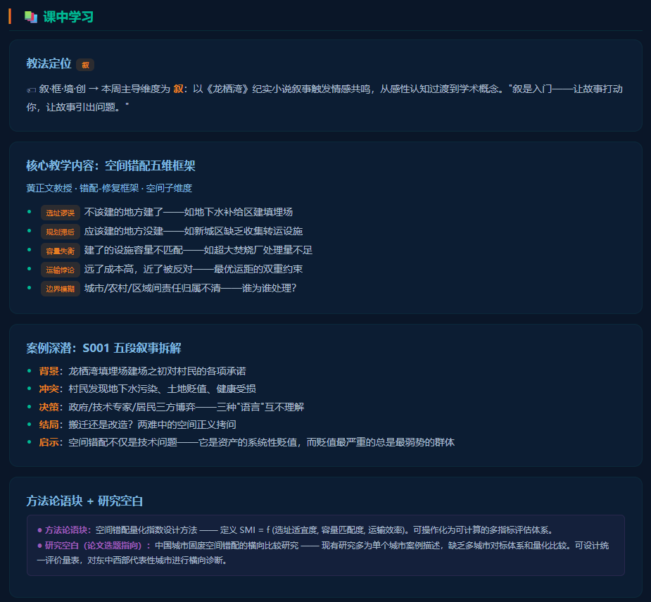
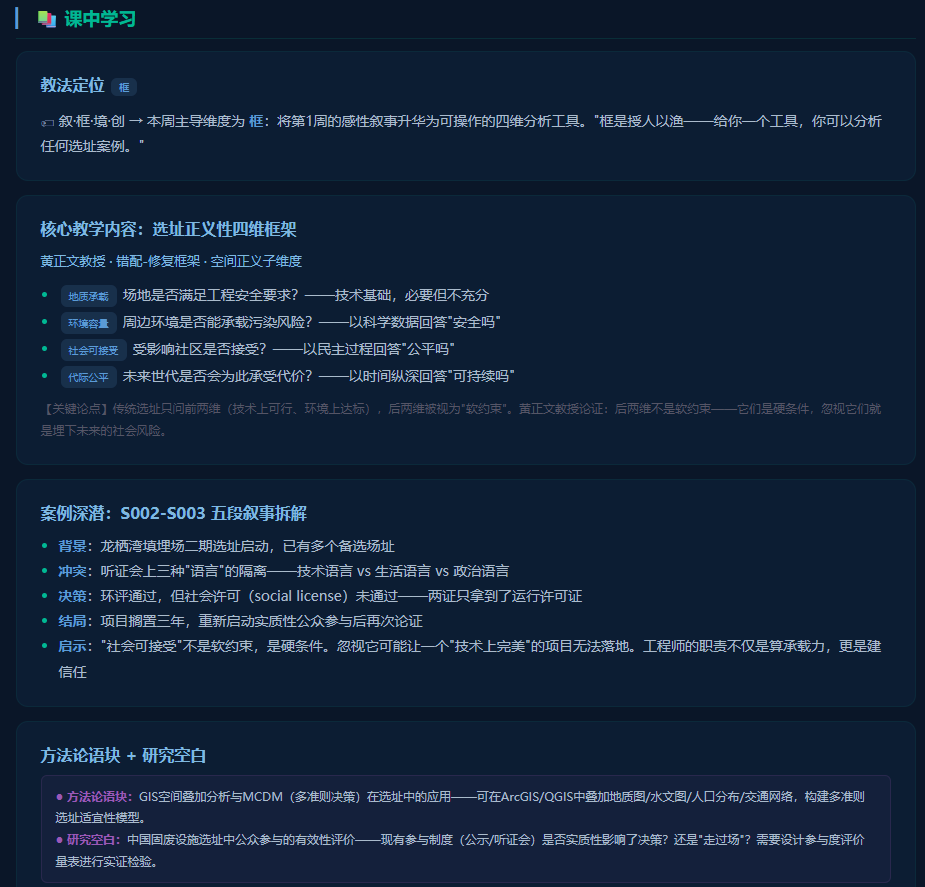
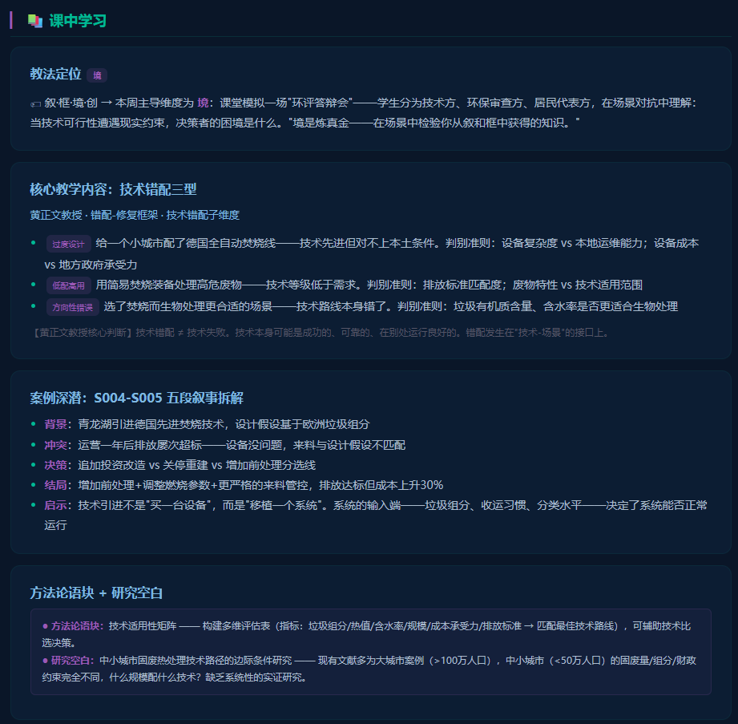
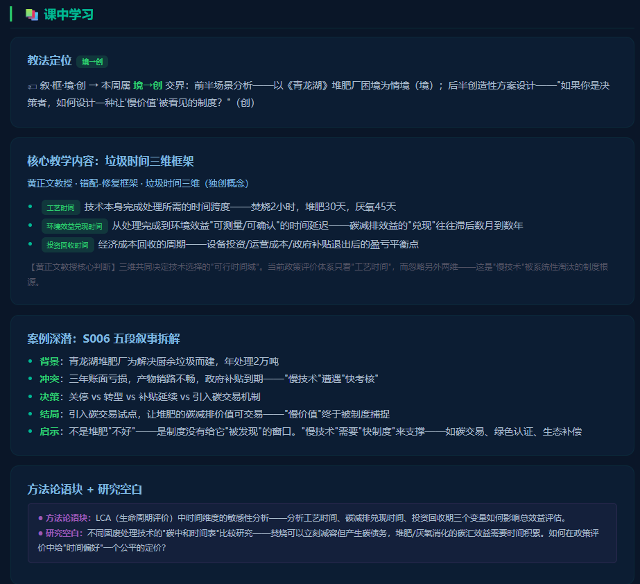
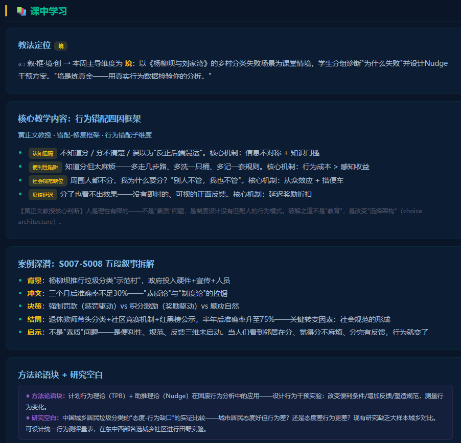
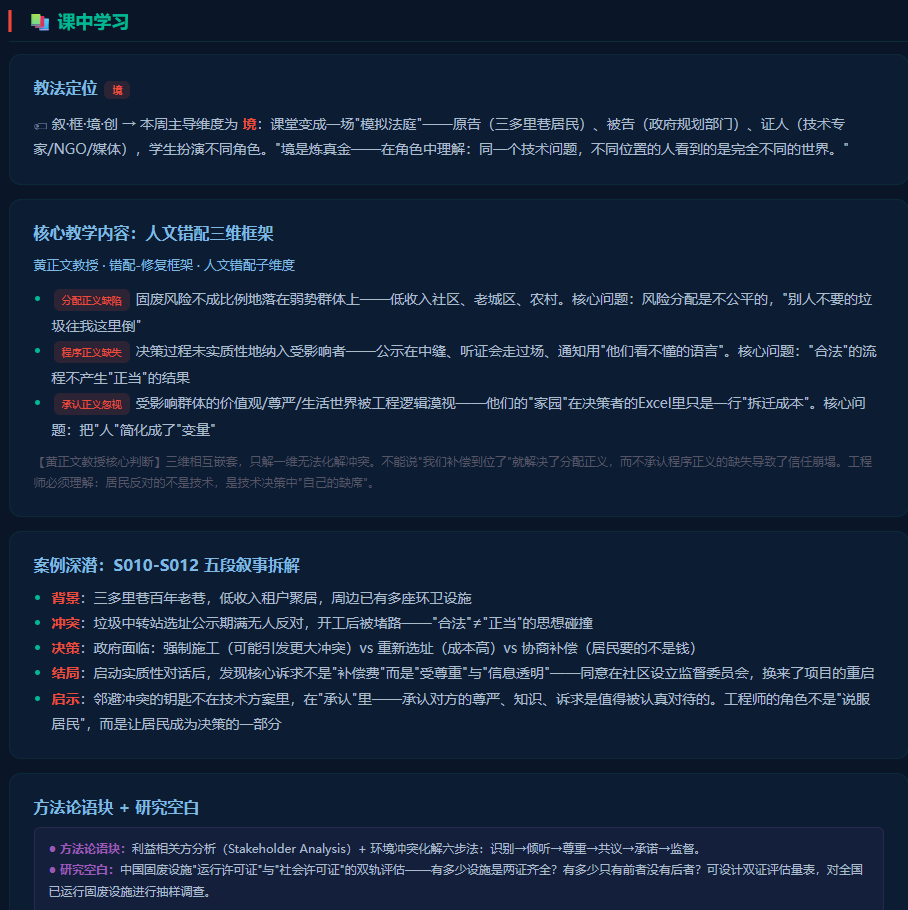
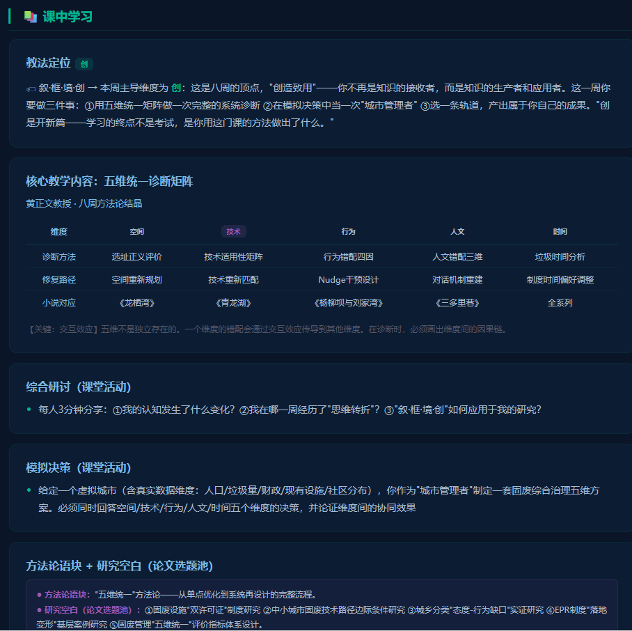

# 基于OBE理念的"五维错配-修复"框架教学设计——以《固体废弃物污染防治技术》为例

黄正文¹，谢泽宇²，曾丽¹

（1. 成都大学 建筑与土木工程学院 环境工程系，成都 610106；2. 西那瓦国际大学 Shinawatra University，泰国）

**摘要**：成果导向教育（OBE）要求课程设计从"教师教了什么"转向"学生能做什么"。然如何将抽象课程目标转化为具体、可操作、逐周递进的教学活动序列，仍是工程教育领域长期未解之"最后一公里"问题。本文以成都大学研究生课程《固体废弃物污染防治技术》为案例，系统阐述"五维错配-修复"框架之学理建构与教学设计应用。此框架以"错配"为核心概念，构建空间错配五维、选址正义性四维、技术错配三型、垃圾时间三维、行为错配四因、EPR错配三源、人文错配三维共六个子框架，终整合为五维统一诊断矩阵（空间×技术×行为×人文×时间）。文章详述每一子框架之维度构成、判别准则与修复路径，展示框架驱动之八周递进式教学设计——自空间认知建立（第1-2周）至技术认知深化（第3-4周）至行为认知拓展（第5-6周）至人文认知升华（第7周）至综合思维整合（第8周）——并建立四条OBE课程目标与八周教学内容之间的双向映射矩阵。框架设计恪守"教学可操作性优于理论完备性"原则——每子框架维度数保持三至五个，确保学生于两周内完成"理解→练习→应用"之完整认知循环。

**关键词**：OBE；教学设计；错配-修复框架；五维矩阵；工程教育；研究生课程

**中图分类号**：G642.0 &nbsp;&nbsp;&nbsp; **文献标志码**：A &nbsp;&nbsp;&nbsp; **文章编号**：待定

---

## OBE-Driven Instructional Design Based on the Five-Dimensional Mismatch-Repair Framework: A Case Study of "Solid Waste Pollution Prevention and Control Technology"

HUANG Zhengwen¹, XIE Zeyu², ZENG Li¹

(1. Department of Environmental Engineering, College of Architecture and Civil Engineering, Chengdu University, Chengdu 610106, China; 2. Shinawatra University, Thailand)

**Abstract**: Outcome-Based Education (OBE) requires curriculum design to shift from "what the teacher taught" to "what the student can do," yet transforming abstract course objectives into concrete, operable, week-by-week progressive teaching activity sequences remains a persistent "last mile" problem in engineering education. Taking the graduate course "Solid Waste Pollution Prevention and Control Technology" at Chengdu University as a case study, this paper systematically elaborates the theoretical construction and instructional design application of the "Five-Dimensional Mismatch-Repair" framework. Centered on the core concept of "mismatch," the framework constructs six sub-frameworks—Five Dimensions of Spatial Mismatch, Four Dimensions of Siting Justice, Three Types of Technological Mismatch, Three Dimensions of Waste Time, Four Factors of Behavioral Mismatch, Three Sources of EPR Mismatch, and Three Dimensions of Humanistic Mismatch—ultimately integrated into a Five-Dimensional Unified Diagnostic Matrix (Space × Technology × Behavior × Humanism × Time). The paper derives in detail the dimensional composition, diagnostic criteria, and repair pathways of each sub-framework, demonstrates an eight-week progressive instructional design driven by the framework—spatial cognition establishment (Weeks 1-2), technological cognition deepening (Weeks 3-4), behavioral cognition expansion (Weeks 5-6), humanistic cognition elevation (Week 7), and integrative thinking consolidation (Week 8)—and establishes a bidirectional mapping matrix between four OBE course objectives and eight weeks of instructional content. The framework design adheres to the principle of "pedagogical operability over theoretical completeness"—each sub-framework maintains 3-5 dimensions, ensuring students can complete a full cognitive cycle of "understanding→practice→application" within two weeks.

**Key words**: OBE; instructional design; mismatch-repair framework; five-dimensional matrix; engineering education; graduate courses

---

## 0 引言

自2017年以来，中国工程教育专业认证全面对接《华盛顿协议》，OBE（成果导向教育）理念成为课程设计的核心框架[1]。OBE要求教学设计的逻辑起点从"教师准备教什么"反转为"学生学完后应该能做什么"，并将这一逻辑贯穿课程目标制定、教学内容选择、教学活动设计和学习效果评价的全过程。

然而，在工程研究生课程中，OBE理念的落地长期面临一个"最后一公里"问题：课程目标（如"能分析固废问题的多维错配""能提出工程修复方案"）是抽象的，而教学内容必须具体到"第X周讲什么、用什么案例、布置什么作业"。两者之间的映射不是自动生成的——需要一套"中间层"框架，将抽象目标翻译为可操作的教学设计。

现有的教学设计框架——如Bloom认知分类学[2]、ADDIE模型[3]、逆向设计（Understanding by Design）[4]——提供了普适性的教学设计方法论，但它们在两个维度上不足以解决工程课程的"最后一公里"问题。第一，它们是内容中性的——不区分"分析固废问题"与"分析文学文本"在认知操作上的差异。第二，它们不提供领域特定的分析工具——ADDIE可以帮你设计一门课程的结构，但不能帮你决定"空间错配应该分几个维度来分析"。

本文以成都大学研究生课程《固体废弃物污染防治技术》为案例，系统阐述"五维错配-修复"框架的学理建构及其在OBE教学设计中的应用。此框架乃黄正文教授根据固废管理的学科特性原创的一套领域特定的教学设计工具——它不是替代Bloom分类学，而是架设在Bloom分类学与具体教学内容之间的一座桥梁。

## 1 框架总论：为什么是"错配"

### 1.1 "错配"概念的跨学科溯源

"错配"（mismatch）在经济学中是一个经典概念——资源错配（resource misallocation）指生产要素未能流向最有效率的用途，导致总产出低于潜在最优水平[5]。在城市经济学中，空间错配（spatial mismatch）指就业机会与劳动力在空间上的不匹配[6]。在进化生物学中，演化错配（evolutionary mismatch）指生物体经过自然选择形成的特质与当前环境之间的不适应[7]。

"五维错配-修复"框架将"错配"从经济学、地理学和生物学中迁移至固废管理领域，赋予它一个新的认识论立场：固废问题的本质不是"垃圾太多"，而是"人与废弃物之间、技术方案与场景条件之间、行为激励与制度设计之间、社会价值分配之间的多维错配"。这一立场的教育学意义在于——它为学生提供了一个统一的认知视角，使他们可以将表面上分散的固废知识（处理工艺、政策工具、伦理议题）统一在一个"诊断→修复"的分析逻辑之下。

### 1.2 框架的总分结构

五维错配-修复框架采用"总-分-总"的三层结构。底层是六个独立子框架，分别对应空间错配（空间错配五维、选址正义性四维）、技术错配（技术错配三型、垃圾时间三维）、行为错配（行为错配四因、EPR错配三源）和人文错配（人文错配三维）四个认知领域，时间维度贯穿其中。中层是子框架之间的递进逻辑——空间→技术→行为→人文——从物理约束到技术选择到人的行为到社会价值，认知加工深度逐层升高。顶层是五维统一诊断矩阵——将空间、技术、行为、人文、时间五个维度的诊断方法和修复路径整合在一张五列诊断表中，供学生在第8周综合应用。

### 1.3 框架设计的"3-5维度"原则

每一个子框架的维度数被限制在3-5个。这不是出于美学偏好，而是基于教学的可操作性考量。一个维度过多的框架（如>7维）会给学生带来过高的认知负荷——他们需要同时记住7个以上的分析维度并在案例中逐一应用。一个维度过少的框架（如2维）无法覆盖该错配类型的主要分析视角，诊断能力不足。3-5维在"完整性"与"可操作性"之间取得了平衡——学生可以在两周的教学周期内完成"理解框架→在案例中练习→独立使用框架分析新案例"的完整认知循环。这一原则在六个子框架的维度设计中贯穿始终。

## 2 六个子框架的学理建构

### 2.1 空间错配五维（第1周）与选址正义性四维（第2周）

空间错配五维框架（图1）定义了固废设施

在空间中"被放错位置"的五种典型模式。选址谬误——不该建的地方建了，如在地下水补给区建设垃圾填埋场，将地质约束置换为污染风险。规划滞后——应该建的地方没建，如城市新区扩张后原有的垃圾收运体系覆盖不到新建社区，服务密度与人口密度不匹配。容量失衡——建了的设施规模与实际需求不匹配，如垃圾焚烧厂设计规模超出实际垃圾产生量导致长期低负荷运行。运输悖论——垃圾处理设施距离居民区太近引发邻避冲突，太远运输成本指数级上升。边界模糊——跨行政区划的固废处理责任归属不清，A市的垃圾流入B县的处理设施，设施的选址决策者与垃圾的产生者不是同一行政主体。

选址正义性四维框架（图2）

在前一周"空间错配"的基础上引入了公平性维度。地质承载——场地是否满足工程安全要求，回答"能不能建"。环境容量——周边环境是否能承载污染风险，回答"安不安全"。社会可接受——受影响社区是否接受，回答"公不公平"。代际公平——未来世代是否会为此承受代价，回答"可不可持续"。后两个维度的引入是框架的教育创新所在——它将选址从技术问题扩展为正义问题，为学生提供了从"技术合理性"到"社会正当性"的认知过渡。

### 2.2 技术错配三型（第3周）与垃圾时间三维（第4周）

技术错配三型框架（图3）

的核心判断是：技术错配不等于技术失败——技术本身可能是成功的、可靠的、在别处运行良好的，错配发生在"技术-场景"的接口上。过度设计——技术先进但超出本地运维能力和财政承载力，如小城市引进全自动德国焚烧线。低配高用——技术装备等级低于需求，如用简易焚烧装备处理危险废物。方向性错误——技术路线本身选错了，如含高有机质的餐厨垃圾选择了焚烧而非生物处理。

技术错配三型的设计遵循了"从案例归纳到类型建构"的认知逻辑。教师不是先给出三种类型让学生记，而是先给出4-5个国内外固废技术失败的案例（含《青龙湖》S004-S005），让学生归纳"失败的原因可以分成哪几类"，然后用学生的归纳与三型框架对照，讨论"你的分类和这个框架有什么异同"。这一教学设计实现了OBE理念的核心要求——框架的呈现方式是让学生"发现"它而非"被告知"它。

垃圾时间三维框架（图4）是六个

子框架中最具有概念原创性的一个。它引入了被技术选择讨论长期忽略的"时间"维度。工艺时间——技术本身完成处理的所需时间（焚烧2小时，堆肥30天，厌氧45天）。环境效益兑现时间——从处理完成到环境效益可测量的延迟（堆肥的碳减排效益需要数月到数年才能被LCA工具捕捉）。投资回收时间——经济成本的回收周期。这三个维度共同揭示了一个被"最快工艺时间=最优技术"的直觉偏好所遮蔽的真理——"慢技术"不是因为技术落后而"慢"，而是因为它的价值兑现周期与当前的评价体系不匹配。堆肥厂三年未盈利的困境（《青龙湖》S006）不是技术的失败，而是"快制度"与"慢效益"之间的时间错配。

### 2.3 行为错配四因（第5周）与EPR错配三源（第6周）

行为错配四因框架（图5）旨在解释

"固废管理系统在技术上完全可行，但在人的行为上推不动"这一经典困境。认知阻隔——不知道分、分不清楚、误以为"反正后端混运"。便利性陷阱——知道分但太麻烦，行为成本大于感知收益。社会规范缺位——周围人都不分，个人没有从众压力，甚至被搭便车效应拖累。反馈延迟——分了也看不出效果，无即时正向强化。

四因框架的教学设计遵循"先直觉后框架"的对比教学法。学生先凭直觉分析《杨柳坝与刘家湾》S007-S008中"分类为什么推不动"，然后教师引入四因框架，学生重新分析同一案例并对比两次分析的差异。这一对比使学生亲身体验了"框架帮你看见了什么"——框架的价值不在于替代直觉，而在于让模糊的直觉变得结构化、可分析和可传达。

EPR错配三源框架将行为分析的视角从个体（居民）延伸到制度（生产者）。责任界定模糊——谁回收、回收多少、标准是什么、钱谁出。执行成本转嫁——名义上生产者付，实际上消费者付（产品涨价）或无人付（非法倾倒）。监督失灵——监管者与生产者之间的信息不对称导致"合规成本>罚款×被查概率"。EPR三源框架的教学价值在于：它使学生看到的不仅是"企业为什么不愿意负责"的表象，更是"制度设计者的激励结构是否能让合规成为企业的理性选择而非道德选择"的深层。

### 2.4 人文错配三维（第7周）

人文错配三维框架（图6）是全课程

认知深度的顶点。分配正义缺陷——固废风险不成比例地落在弱势群体上。程序正义缺失——决策过程未实质性地纳入受影响者（公示在中缝的小字里）。承认正义忽视——受影响群体的尊严、价值观和生活世界被工程逻辑漠视（张婆婆"没有人问过我的意见"）。三个维度的递进逻辑同时是认知的深化路径——从"看到了不公平"（分配）到"追问程序是否有缺陷"（程序）到"理解被忽略的尊严"（承认）。人文错配三维是六个子框架中唯一一个不可被量化为评分矩阵的框架——因为承认正义无法被简化为一个数值——而正是这一属性使它成为课程价值观教育的顶点。

### 2.5 五维统一诊断矩阵（第8周）

经过七周的独立框架教学，第8周将六个子框架整合为一张五维统一诊断矩阵（图7）

。矩阵的五列分别对应空间、技术、行为、人文、时间五个维度，三行分别对应"现状诊断——根源分析——修复路径"三个分析步骤，形成一张15格的综合诊断表。

矩阵的整合方式不是简单汇总——它要求学生标注维度间的交互效应，例如"空间错配如何加剧行为错配"（设施太远→居民看不到处理过程→"反正分了也白分"→行为错配），"技术错配如何放大人文错配"（选择了超出本地运维能力的焚烧技术→排放超标风险升高→受影响居民的信任崩塌→人文错配）。交互效应的标注是五维统一的核心——它不是让学生"把五个维度都写了一篇"了事，而是让学生论证维度之间的因果链——这一认知操作直接将学生的思维水平从"多角度分析"推向了"系统性分析"。Bloom分类学中的"综合→评价→创造"三个最高认知层次在此被具体化为一组可操作的教学指令。

## 3 框架驱动的八周教学设计

八周教学设计的时间线、框架分布和认知递进逻辑如下表所示。

| 周次 | 主导维度 | 核心框架 | 教法定位 | 认知层次(Bloom) |
|------|----------|----------|----------|----------------|
| 第1周 | 空间 | 空间错配五维 | 叙 | 识记→理解 |
| 第2周 | 空间 | 选址正义性四维 | 框 | 理解→应用 |
| 第3周 | 技术 | 技术错配三型 | 境 | 应用→分析 |
| 第4周 | 技术 | 垃圾时间三维 | 境→创 | 分析→评价 |
| 第5周 | 行为 | 行为错配四因 | 境 | 分析 |
| 第6周 | 行为 | EPR错配三源 | 框→境 | 分析→评价 |
| 第7周 | 人文 | 人文错配三维 | 境 | 评价 |
| 第8周 | 综合 | 五维统一诊断矩阵 | 创 | 创造 |

认知递进的设计逻辑是：每周引入一个新框架，框架的认知复杂性逐周递增——从较易掌握的五维/四维（第1-2周）到更需反思的三维（第7周），从物理约束（空间）到社会价值（人文）；每周的认知层次操作也逐周递增——从"识记→理解"到"分析→评价→创造"；教法标签（叙→框→境→创）与Bloom层次形成双重递进结构。

## 4 OBE课程目标-教学内容映射

课程的四个OBE目标与八周教学内容的映射关系构成了框架有效性的最直接证据。

| OBE目标 | 支撑周次 | 主要框架 | 评价方式 |
|---------|---------|----------|----------|
| ① 能分析固废问题的多维错配 | 第1-7周全部 | 全部六个子框架 | 每周作业+课堂场景参与 |
| ② 能提出工程修复方案 | 第3,4,6,8周 | 技术错配三型、垃圾时间三维、EPR错配三源、五维矩阵 | 课程设计(轨道B) |
| ③ 能融入工程伦理与社会维度 | 第2,5,6,7周 | 选址正义性四维、行为错配四因、EPR错配三源、人文错配三维 | 模拟法庭参与+课程论文分析 |
| ④ 形成系统性思维 | 第8周 | 五维统一诊断矩阵 | 结课论文/设计/教改(三轨) |

每一个子框架在教学中的功能不是"独立服务一个OBE目标"，而是"以一个目标为主、同时承托其他目标"。以选址正义性四维（第2周）为例，它的主要服务对象是②和③——"社会可接受"和"代际公平"维度直接训练"融入工程伦理与社会维度"；同时它也在为①做铺垫——学生在学习"如何评价选址的正义性"时，就是在学习"如何分析固废问题的空间维度错配"。

## 5 讨论

"五维错配-修复"框架的普适性迁移需要回答一个关键问题：框架的六个子框架中有几个是固废管理特有的？"垃圾时间三维"概念是在固废课程中原创的，它的直接迁移需要目标课程具有类似的"技术时间偏好"问题（如新能源领域中"光伏板回收的时间效益延迟"）。"空间错配五维"中的五个维度（选址谬误/规划滞后/容量失衡/运输悖论/边界模糊）在其他涉及空间选址的工程课程中几乎可以直接使用或调整后使用。选址正义性四维、技术错配三型、行为错配四因、EPR错配三源和人文错配三维具有较高的跨课程适用性——它们的底层分析逻辑（公平性、适用性、行为激励、制度公平、社会正义）是工程实践中的通用议题。

框架本身的开放性也是值得讨论的设计选择。在"创"维度的教学中——特别是轨道A的课程论文——学生被要求讨论框架尚未覆盖的"第六维"。这一要求不是形式化的"提两个改进建议"——它是对框架设计逻辑的反身性质疑：框架是否因为维度的限制反而遮蔽了某些重要的分析视角？有学生在课程论文中提出"制度空间"应作为一个独立维度——指跨行政区划的制度性错配（如两座相邻城市的固废设施规划完全独立，导致设施重复建设或服务盲区）。这一反馈提示："五维统一"的"五"是一个基于教学可操作性的选择，而非基于本体论完整性的论断——框架应保持对扩展和修正的开放。

## 6 结论

本文提出了"五维错配-修复"框架——一个为工程研究生课程定制、以OBE理念驱动的领域特定教学设计工具。此框架之核心贡献有三：以"错配"为核心概念，将固废管理问题统一在"诊断→修复"的认识论框架下；构建了六个子框架——空间错配五维、选址正义性四维、技术错配三型、垃圾时间三维、行为错配四因、EPR错配三源、人文错配三维——每个子框架包含3-5个维度，确保在教学可操作性（学生可在两周内掌握）和认知完整性之间取得平衡；通过"五维统一诊断矩阵"将独立讲授的框架整合为综合诊断工具，并要求学生标注维度间交互效应，将系统性思维的训练具体化为一组可操作的指令。

框架设计遵循"教学的可操作性优先于理论的完备性"原则——六个子框架的维度数不是从本体论分析推导出来的，而是从八周教学周期的认知负荷约束推导出来的。这一原则意味着框架本身是可修正的——当一个子框架的维度数不足以覆盖教学需求，当新的叙事素材暴露出框架未包含的分析视角，框架应被迭代而非固守。

---

## 参考文献

[1] 中国工程教育专业认证协会. 工程教育认证标准（2024版）[Z]. 2024.

[2] ANDERSON L W, KRATHWOHL D R. A Taxonomy for Learning, Teaching, and Assessing: A Revision of Bloom's Taxonomy of Educational Objectives[M]. New York: Longman, 2001.

[3] BRANCH R M. Instructional Design: The ADDIE Approach[M]. New York: Springer, 2009.

[4] WIGGINS G, MCTIGHE J. Understanding by Design[M]. 2nd ed. Alexandria: ASCD, 2005.

[5] HSIEH C T, KLENOW P J. Misallocation and Manufacturing TFP in China and India[J]. Quarterly Journal of Economics, 2009, 124(4): 1403-1448.

[6] KAIN J F. Housing Segregation, Negro Employment, and Metropolitan Decentralization[J]. Quarterly Journal of Economics, 1968, 82(2): 175-197.

[7] GLUCKMAN P, HANSON M. Mismatch: Why Our World No Longer Fits Our Bodies[M]. Oxford: Oxford University Press, 2006.

[8] 黄正文. 固体废弃物污染防治技术研究生自编讲义（2025年版）[Z]. 成都大学, 2025.

[9] SPADY W G. Outcome-Based Education: Critical Issues and Answers[M]. Arlington: American Association of School Administrators, 1994.

[10] 黄正文. 普惠教育咨询·读书改变命运秘笈系列纪实网络小说（七部，S001-S021教学选段）[M/OL]. QQ阅读/17K文学.

---

**收稿日期**：2026-05-25 &nbsp;&nbsp;&nbsp; **修回日期**：待定

**基金项目**：成都大学精品课程建设项目

**作者简介**：黄正文（19XX—），男，教授，硕士生导师，研究方向：资源与环境普惠教育.E-mail:xxxx@cdu.edu.cn。

**利益冲突声明**：无。

---

*叙·框·境·创 四维教学法 · 故事云驱动 · 点暇叙事 匠心教学 · 黄正文（点暇斋）· 全部作品版权登记*
