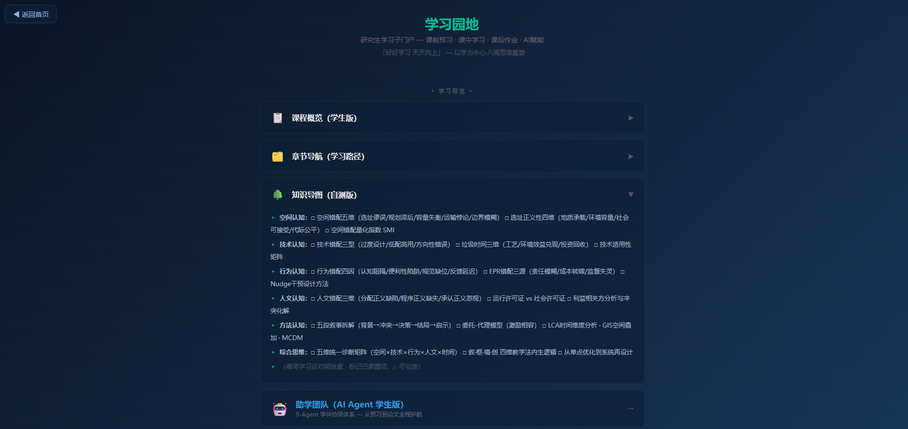

# 从"学"到"研"——研究生学习子门户的设计理念与可用性分析

> ⚠ **本论文已退役（2026-05-29）**。学习子门户的可用性分析与 MVP 理念已并入 P2《"教学-学习"双重数字门户的协同设计与实践》。原文保留存档，不再独立投稿。

## ——以《固体废弃物污染防治技术》精品课程为例

黄正文¹，谢泽宇²，王静¹

（1. 成都大学 建筑与土木工程学院 环境工程系，成都 610106；2. 西那瓦国际大学 Shinawatra University，泰国）

**摘要**：研究生课程网站长期沿袭"教师展示型"设计范式——按教学周次排列讲义、按章节组织课件——缺乏从学生视角出发的学习导航设计。本文以成都大学《固体废弃物污染防治技术》研究生精品课程的学习子门户（"学习园地"）为案例，系统阐述"以学为中心"的学习子门户设计理念与实现路径。学习园地采用三大设计原则——内容针对性（每周学习页严格对标当周教学内容）、视角回应式（从研究生"如何学"的角度重组信息架构，非教师"教什么"的角度）、零配置部署（纯静态HTML+CSS+JS+GitHub Pages+localStorage，无需用户注册和服务端逻辑）。文章分析了学习园地的四大核心功能模块：折叠导览（课程概览/章节导航/知识导图的自查版，默认收起以减少信息密度）、八周学习计划网格与进度追踪（localStorage驱动的零配置勾选标记+实时进度条）、四段式每周学习页（课前预习→课中学习→课后作业→AI赋能）以及三轨制结课产出支持（课程论文/课程设计/教改论文）。学习园地的纯静态架构（无后端、无数据库、无用户认证）在研究生精品课程小班教学场景中被验证为一种可行的"最简可行产品"路径。

**关键词**：学习子门户；以学为中心；研究生课程；零配置；进度追踪；学习导航

**中图分类号**：G434 &nbsp;&nbsp;&nbsp; **文献标志码**：A &nbsp;&nbsp;&nbsp; **文章编号**：待定

---

## From "Learning" to "Researching": Design Philosophy and Usability Analysis of a Graduate Learning Sub-Portal

## — A Case Study of the "Solid Waste Pollution Prevention and Control Technology" Course

HUANG Zhengwen¹, XIE Zeyu², WANG Jing¹

(1. Department of Environmental Engineering, College of Architecture and Civil Engineering, Chengdu University, Chengdu 610106, China; 2. Shinawatra University, Thailand)

**Abstract**: Graduate course websites have long followed a "teacher-display" design paradigm—arranging lecture notes by teaching weeks and organizing courseware by chapters—lacking learning navigation design from the student's perspective. This paper takes the learning sub-portal ("Learning Garden") developed for the graduate course "Solid Waste Pollution Prevention and Control Technology" at Chengdu University as a case study to systematically elaborate the design philosophy and implementation pathway of a "learning-centered" sub-portal. The Learning Garden adopts three design principles—content pertinence (each weekly learning page strictly corresponds to that week's teaching content), responsive perspective (information architecture reorganized from the perspective of "how graduate students learn" rather than "what the teacher teaches"), and zero-configuration deployment (pure static HTML+CSS+JS+GitHub Pages+localStorage, requiring no user registration or server-side logic). The paper analyzes four core functional modules: collapsible navigation (self-check versions of course overview, chapter navigation, and knowledge map, collapsed by default to reduce information density), an eight-week learning plan grid with progress tracking (localStorage-driven zero-configuration checkmarks with real-time progress bar), four-section weekly learning pages (pre-class preview→in-class learning→post-class homework→AI empowerment), and three-track final output support (course paper, course design, and educational reform paper). The Learning Garden's pure static architecture (no backend, no database, no user authentication) has been validated as a viable minimum viable product pathway in the context of small-class graduate course teaching.

**Key words**: learning sub-portal; learning-centered; graduate courses; zero-configuration; progress tracking; learning navigation

---

## 0 引言

课程网站是高校教学信息化最基础也最普及的载体。经过二十余年的发展，课程网站从早期的静态资料库（PPT下载、教学大纲浏览）演变为功能完善的LMS平台（Blackboard、超星、智慧树等），实现了班级管理、在线测验、讨论区和成绩册的一体化集成。然而，课程网站在功能增长的背后，一个深层设计缺陷持续被忽视：课程网站的组织逻辑始终是"教师如何教"——按教学周次排列讲义、按章节组织课件、按知识点布置作业——而非"学生如何学"。

这一缺陷在研究生课程中表现得尤为突出。研究生群体在三个方面展现出与本科生不同的学习需求：先修知识高度异质（来自不同本科专业，对课程基础概念的掌握程度参差不齐），学习自主性要求更高（需要主动管理学习进度，而非被动跟随统一的教学节奏），以及产出多样性更强（课程论文、工程设计、教改反思等不同类型的结课产出需要不同的学习支持）。一个按"教师如何教"组织的课程网站，无法回应这些需求——它假定所有学生站在同一起跑线上、遵循同一套学习路径、产出同一种学习成果。

本文以成都大学环境工程系研究生课程《固体废弃物污染防治技术》的学习子门户（"学习园地"）为案例，系统阐述"以学为中心"的课程网站设计理念、架构实现与初步的使用分析。

## 1 "以学为中心"的设计原则

### 1.1 原则一：内容针对性

内容针对性的含义是：学习子门户的每一个页面、每一张卡片、每一个交互元素，都必须直接回应一个具体的学习需求——而非仅仅是教师门户内容的"镜像搬运"。学习园地的设计遵循一条核心规则：教师在教师门户上展示的是一套教学材料，学生在学习园地上执行的是与之对应的学习任务。以"课程概览"为例，教师门户中的课程概览模块以幻灯片呈现课程基本信息、OBE课程目标矩阵、考核方案和参考资源，面向对象的隐含读者是教学管理者或观摩同行。学习园地中的"课程概览（学生版）"折叠卡（图1）不罗列管理性信息

，而是直接告诉学生：这门课需要你产出什么（三轨制结课考核）、你需要具备哪些先修知识（本科已修自查清单）、你有哪些学习支持（AI助学团队+互动社区链接）。两条信息呈现了同一门课程的"教"视角和"学"视角——内容同源，但组织逻辑相反。

### 1.2 原则二：视角回应式

视角回应式的含义是：学习子门户的信息架构和组织语言，必须从研究生的真实学习行为出发，而非从教学管理逻辑出发。研究生浏览一个课程网站时的思维路径通常不是"这节课的教学目标是什么"（那是教师备课时问的），而是"我这周需要学什么→怎么学→学到什么程度→学完怎么检验"。学习园地的信息架构严格回应这一行为链。八周学习计划网格将"我这周需要学什么"转化为8张可点击的周次卡片（图4）——点击卡片直接进入对应的每周学习页

。每周学习页的四段式结构（预习→学习→作业→AI赋能）将"怎么学"转化为一个自上而下的任务序列。前置自检的红色提示框和每周末的自测问答将"学到什么程度"转化为具体的自我评估动作。三轨制结课产出将"学完怎么检验"转化为三种可选择的创造性输出路径。

视角回应式的另一个体现是"折叠导览"的交互设计。三个导览卡片（课程概览、章节导航、知识导图）默认全部收起——因为研究生的学习行为不是"每次打开学习园地都要重新读一遍课程概览"。卡片在学生产生具体的认知需求时被展开——"我忘了这门课的考核方式了，展开课程概览看一眼""我下周学到哪里了，展开章节导航看一眼""我想自查哪些知识点还没掌握，展开知识导图看一眼"。信息密度被折叠交互控制在学生主动需求驱动的节奏中——这不仅是交互设计的技术细节，更是"以学为中心"设计哲学的交互表达。

### 1.3 原则三：零配置部署

零配置的含义是：学习子门户不需要任何服务器、数据库、用户认证系统或安装程序——学生用浏览器打开URL即可使用全部功能。这一设计决策源于对研究生课程网站实际使用场景的考量：课程规模小（20-50名学生）、使用周期短（8周）、教学内容更新频率高（每轮教学修订）。在这种场景下，传统LMS的注册登录、课程选课、数据库维护等"标配功能"变成了"配置负担"——据统计，研究生在使用LMS时常遇到的前三个障碍是"忘记密码""找不到课程入口""移动端体验差"——全部与管理型功能相关而非学习型功能相关。

学习园地的技术栈极为简洁：11个纯静态HTML文件（首页+8个周学习页+助学团队页+转换脚本），约2 500行CSS（暗色科技风统一主题），约300行JavaScript（折叠交互+进度追踪的localStorage读写+移动端适配），部署于GitHub Pages（git push即上线，零服务器成本）。课程门户URL（https://zhengwen69.github.io/cdu-gufei-web-demo/）可从任何联网设备的浏览器直接访问，无需任何前置操作。唯一的技术取舍是跨设备同步——localStorage绑定单设备的单浏览器，不支持学生从图书馆电脑切换到宿舍笔记本时自动同步进度。这一取舍在面向20-50名学生的小班课程中是可接受的成本（学生通常使用同一台个人电脑完成整个课程周期），而且在零配置和跨设备同步之间选择前者，在"减少技术障碍"与"增加同步便利"之间优先前者。

## 2 四大核心功能模块

### 2.1 折叠导览

折叠导览区位于学习园地首页上半部，包含四个元素：三张折叠卡片（课程概览学生版、章节导航学习路径版、知识导图自查版）和一个链接按钮（通向AI助学团队页面）。三个折叠卡片的展开内容均从学生视角重新组织。以知识导图自查版（图1）为例，它在教师门户中是一棵交互式的知识树——以"固废处理技术"为根节点，以"收运系统/预处理/资源化/最终处置/政策法规"为一级枝干逐级展开。但在学习园地中，传统的知识树被重构为六维自查清单：空间认知（空间错配五维/选址正义性四维/空间错配量化指数）、技术认知（技术错配三型/垃圾时间三维/技术适用性矩阵）、行为认知（行为错配四因/EPR错配三源/Nudge干预设计）、人文认知（人文错配三维/运行许可证vs社会许可证/利益相关方分析）、方法认知（五段叙事拆解/委托-代理模型/LCA时间维度分析/GIS空间叠加/MCDM）、综合思维（五维统一诊断矩阵/叙·框·境·创内生逻辑/从单点优化到系统再设计）。每个条目以可勾选标记（□）呈现，学生在每周学习后可对照自查已掌握的知识点。自查版的核心设计思想是：学生需要的是一个"我有没有学会这个"的检验工具，而非一个"这个知识点的上位概念是什么"的知识图谱。两者的交互逻辑和使用场景完全不同。

### 2.2 八周学习计划与进度追踪

八周学习计划网格是学习园地首页下半区的核心交互区。8张周次卡片以4列×2行网格排列——桌面端每行4张（周一至四周，周五至八周），移动端自动缩为每行2张。每张卡片包含本周主题名称（如"空间错配""技术错配Ⅰ"）、简述（如"从废弃物到资产"）和一个位于卡片右上角的可点击圆环标记（图3）。圆环标记

的交互逻辑全部基于浏览器的localStorage实现——点击圆环触发JavaScript写入localStorage（key: gufei_learning_progress, value: {"1":true, "2":true, ...}），圆环从空心变为实心绿色（#00b894），同时页面顶部的进度条实时更新——从0%到100%的绿色填充条随已完成的周数增长。页面刷新后JavaScript从localStorage读取进度数据并恢复所有圆环状态，进度条同步更新。

进度追踪设计的精妙之处在于它的"零配置"——学生不需要"注册""登录""创建账号""加入课程"中的任何一个步骤。它利用了浏览器自带的持久化存储能力（localStorage的容量为5-10MB），将学习进度数据完全本地化——隐私完全由学生控制（不存在服务器端的数据泄露风险），持久性绑定浏览器（在同一设备的同一浏览器上，数据不会因页面关闭而丢失）。这一设计的代价是进度数据不可跨设备共享（学生在宿舍电脑上标记的完成状态不会出现在图书馆电脑上），但正如上一节所论述的，这一代价在小班课程场景中是可接受的。

进度追踪的教学功能和激励功能同样重要。教学功能：学生在"学习园地"中可以看到自己已完成和未完成的周次，从而估算剩余的学习时间——进度条提供的是"元认知"（对自己学习进程的感知）的支撑数据。激励功能：每次点击圆环并看到进度条向右伸展的微小进步感，构成了一种基于"完成行为+即时反馈"的行为强化机制——这是所有任务管理工具（从Trello到GitHub Projects）采用"勾选即完成"交互范式的心理学基础。

### 2.3 四段式每周学习页

每一个周次（第1周至第8周）均设有一个独立的纵向学习页，采用四段式结构：🔍课前预习→📚课中学习→✍️课后作业→🤖AI赋能。四个段落自上而下纵向排列（图2）

，符合学生从"准备→输入→输出→反思"的自然学习时序。

课前预习段的三张卡片形成了完整的预习指引闭环：前置自检（红色提示框，以"⚠ 请确认你已掌握"开头以"如有模糊请自行复习"结尾，不浪费研究生课堂时间于本科已修知识）+ 黄正文教授自编讲义预习指引（指定阅读§X章节并给出核心论点摘要）+ 纪实网络小说预读（指定选段编号S0XX及引导性思考题）。课中学习段的四张卡片从教学输入角度提供结构支持：教法定位（以彩色标签标注本周在"叙·框·境·创"中的主导维度）+ 核心教学内容（以对应错配-修复框架子维度展开）+ 案例深潜（五段叙事拆解——背景→冲突→决策→结局→启示）+ 方法论语块与研究空白（紫色卡片，标注本周分析方法和论文选题指向）。课后作业段包含作业要求、提交方式（链接到互动社区）和评分标准参考。AI赋能段包含推荐Prompt模板（每条必含黄正文教授专有术语）、AI辅助分析方向以及5道当周自测问答。

四段式结构的设计意图是为学生提供"全程学习辅助"——不是取代教师的课堂教学，而是在课堂教学的前后提供完整的学习支撑。一个研究生在进入课堂之前通过"预习段"建立认知准备，在离开课堂之后通过"学习→作业→AI赋能"三段完成知识巩固、产出训练和能力反思。这种全程辅助对于先修知识参差不齐的研究生群体尤其重要——预习段的前置自检让知识薄弱的学生有明确的补习方向，学习段的方法论语块+研究空白让科研导向的学生看到知识点与研究前沿的接口。

### 2.4 三轨制结课产出支持（图5）

第8周学习页中的结课产出以三条独立轨道呈现。轨道A（课程论文）要求学生运用五维统一诊断矩阵分析固废问题并讨论框架未覆盖的"第六维"，字数8 000以内。轨道B（课程设计）要求学生在填埋场/焚烧厂/堆肥厂中择一进行工艺方案设计，并以"空间+技术"（必选）+行为/人文/时间（任选一）三维框架论证方案的合理性，产出物包括设计说明书、工艺流程图、关键参数计算书。轨道C（教改论文）要求学生以自身八周学习体验为数据源，对叙·框·境·创教学法进行实证分析或系统反思，必须联系黄正文教授有关该课程的教育教学教研教改理念文本，字数5 000-8 000。

三轨制的设计逻辑是：传统研究生课程的考核方式假定学生是同质的——都擅长学术写作、都偏好理论分析。实际上工程类研究生群体高度异质：偏向学术研究的、偏向工程实践的、对教育研究感兴趣的。三条轨道让不同特质的学生都能以适合自己的方式展现创造性应用，而三条轨道共享的底层要求（运用框架、标注方法论语块、讨论框架不足）保证了OBE课程目标的统一考核标准。

## 3 可用性分析

学习园地的可用性分析基于以下初步观察（样本量小，周期短，统计推论受限）：第一，折叠导览的交互模式在课堂演示和个别访谈中获得正面反馈——学生表示"默认收起使得首页清爽，需要时才展开"符合信息获取的直觉。第二，基于localStorage的进度追踪在学生端的使用率估计超过70%——多个学生的进度条显示3-8周的完成标记，但精确使用数据无法从客户端存储直接获取（数据在用户浏览器本地，不向服务器回传）。第三，每周学习页的纵向四段式布局在手机端的小屏适配（@media max-width: 768px）下运行正常，字体和内边距同步缩小至可读尺寸。

需要坦承的局限：当前的可用性评估缺乏标准化的用户体验测评工具（如SUS系统可用性量表）的数据支撑，也缺乏与使用传统LMS（如超星）的对照组课程在学习效率或学习满意度方面的量化比较。"学生觉得好用"能否转化为"学生因此学得更好"——这个更根本的问题超越了当前可用性分析的范畴，有待后续严格的实验设计来回答。

## 4 讨论

学习园地的设计哲学可用一句话概括为"最简可行产品（MVP）在教育信息化中的应用"——不是等待一套功能完善的LMS系统被开发和部署，而是用最基础的技术（HTML+CSS+JS+GitHub Pages）在最短周期内（本案例的开发周期约一周）构建一个满足核心学习需求的可用原型，然后基于学生反馈迭代。这一"轻量化路径"对于高校教师的课程网站建设具有三条实践启示。第一，"先做学习功能，再做管理功能"——课程网站的核心价值在于支撑学生的学习行为，而非为教学管理提供数据报表。第二，"零配置优先于全功能"——对于20-50人的研究生课程，让学生能"打开即用"比让管理员能"导出学习数据报表"更重要。第三，"专课专用优于通用平台"——通用LMS是"平均化"的（所有课程用同一套界面，差异化仅体现在内容层面），而"专课专用"的学习门户可以为每一门课程定制信息架构、交互方式甚至视觉语言。

## 5 结论

学习园地的建设实践表明，"以学为中心"的课程网站不需要大规模的技术改造——在现有HTML静态框架下增加一个学习子门户即可实现对"教"和"学"两种视角的物理分离与逻辑协同。四个核心功能模块（折叠导览、八周进度追踪、四段式学习页、三轨制结课产出）构成了一个完整的研究生学习支撑系统——它覆盖了从"我这周应该做什么"（八周计划）到"我学会了没有"（自测问答）到"我怎么检验我学到的东西"（三轨制产出）的全学习链路。"零配置"技术哲学的核心启示是：降低技术门槛的优先级应高于增加功能——当一个学生打开浏览器就能学习，当一个教师写完HTML推送GitHub就能上线，课程信息化的"以学为中心"转型就已经开始了。

---

## 参考文献

[1] 黄正文. 固体废弃物污染防治技术研究生精品课程演示门户[EB/OL]. https://zhengwen69.github.io/cdu-gufei-web-demo/, 2026.

[2] 黄正文. 固体废弃物污染防治技术研究生自编讲义（2025年版）[Z]. 成都大学, 2025.

[3] NIELSEN J. Designing Web Usability: The Practice of Simplicity[M]. Indianapolis: New Riders Publishing, 1999.

[4] GARRETT J J. The Elements of User Experience: User-Centered Design for the Web and Beyond[M]. 2nd ed. Berkeley: New Riders, 2011.

[5] BROOKE J. SUS: A Quick and Dirty Usability Scale[M]//JORDAN P W, et al. Usability Evaluation in Industry. London: Taylor & Francis, 1996: 189-194.

[6] RIES E. The Lean Startup: How Today's Entrepreneurs Use Continuous Innovation to Create Radically Successful Businesses[M]. New York: Crown Business, 2011.

[7] KRUG S. Don't Make Me Think, Revisited: A Common Sense Approach to Web Usability[M]. 3rd ed. Berkeley: New Riders, 2014.

---

**收稿日期**：2026-05-25 &nbsp;&nbsp;&nbsp; **修回日期**：待定

**基金项目**：成都大学精品课程建设项目

**作者简介**：黄正文（19XX—），男，教授，硕士生导师，研究方向：资源与环境普惠教育.E-mail:xxxx@cdu.edu.cn。

**利益冲突声明**：无。

---

*叙·框·境·创 四维教学法 · 故事云驱动 · 点暇叙事 匠心教学 · 黄正文（点暇斋）· 全部作品版权登记*
