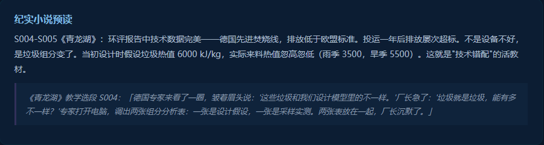

# 工程研究生课程思政的双线叙事路径——"好好学习 天天向上"与"绿水青山=金山银山"的协同育人实践

## ——以《固体废弃物污染防治技术》课程为例

黄正文¹，谢泽宇²，徐青¹

（1. 成都大学 建筑与土木工程学院 环境工程系，成都 610106；2. 西那瓦国际大学 Shinawatra University，泰国）

**摘要**：工程类研究生课程思政长期面临"两张皮"困境——思政元素以口号形式罗列于教学大纲中，与专业教学内容缺乏有机融合。本文以成都大学研究生课程《固体废弃物污染防治技术》为案例，提出"双线叙事思政"路径：一条线是"好好学习 天天向上"承载的学习思政——从学术诚实、持之以恒、主动检验到终身学习的治学态度养成；另一条线是"绿水青山=金山银山"承载的生态思政——从空间正义、技术伦理、制度公平到承认正义的价值意识觉醒。两条线在课程中并非平行推进，而是深度协同——学习思政为生态思政提供方法论支撑（如何通过框架分析、自测评估、三轨产出系统性地理解生态价值），生态思政为学习思政提供价值载体（治学态度最终服务于什么样的工程实践）。课程以黄正文教授已公开发布的七部纪实网络小说（S001-S021教学选段）为叙事素材云，以"叙·框·境·创"四维教学法为教学框架，以"学习园地"数字子门户为实施平台，实现了"看不见的思政"——学生被故事打动、被任务驱动、被框架引导，而非被口号教育。双线叙事思政路径为破解工程课程"两张皮"困境提供了一种结构化的解决方案。

**关键词**：课程思政；学习思政；生态思政；双线叙事；工程伦理；研究生课程；纪实小说

**中图分类号**：G641 &nbsp;&nbsp;&nbsp; **文献标志码**：A &nbsp;&nbsp;&nbsp; **文章编号**：待定

---

## A Dual-Narrative Pathway for Ideological-Political Education in Graduate Engineering Courses: Synergistic Practice of "Study Hard and Make Progress Every Day" and "Clear Waters and Green Mountains Are Mountains of Gold and Silver"

## — A Case Study of "Solid Waste Pollution Prevention and Control Technology"

HUANG Zhengwen¹, XIE Zeyu², XU Qing¹

(1. Department of Environmental Engineering, College of Architecture and Civil Engineering, Chengdu University, Chengdu 610106, China; 2. Shinawatra University, Thailand)

**Abstract**: Ideological-political education in graduate engineering courses has long faced the "dualism" dilemma—ideological-political elements listed as slogans in syllabi without organic integration into professional content. Taking the graduate course "Solid Waste Pollution Prevention and Control Technology" at Chengdu University as a case study, this paper proposes a dual-narrative pathway for curriculum ideological-political education (CIPE). One narrative thread is carried by "Study Hard and Make Progress Every Day," embodying learning ethics—the cultivation of academic honesty, perseverance, proactive self-assessment, and lifelong learning attitudes. The other narrative thread is carried by "Clear Waters and Green Mountains Are Mountains of Gold and Silver," embodying ecological ethics—the awakening of value awareness spanning spatial justice, technological ethics, institutional equity, and recognition justice. These two threads do not run in parallel isolation but in deep synergy: learning ethics provides methodological support for ecological ethics (how to systematically understand ecological values through framework analysis, self-assessment, and three-track output), while ecological ethics provides a value anchor for learning ethics (the engineering practices that academic rigor ultimately serves). The course employs Professor Huang Zhengwen's seven publicly released documentary network novels (21 teaching excerpts, S001-S021) as a narrative material cloud, the "Narrative-Framework-Scenario-Creation" four-dimensional teaching method as the pedagogical framework, and the "Learning Garden" digital sub-portal as the implementation platform, achieving "invisible CIPE"—students are moved by stories, driven by tasks, and guided by frameworks, rather than indoctrinated by slogans. The dual-narrative CIPE pathway offers a structured solution to overcoming the "dualism" dilemma in engineering course ideological-political education.

**Key words**: curriculum ideological-political education; learning ethics; ecological ethics; dual-narrative; engineering ethics; graduate courses; documentary novels

---

## 0 引言

"两张皮"是工程课程思政建设中被反复讨论却始终未能有效破解的结构性困境。思政元素以标语形式罗列在课程大纲的"课程思政"栏目中——"培养社会责任感""树立生态文明观""增强家国情怀"——但教学实践中缺乏将这些抽象目标转化为具体教学活动的操作路径。学生读完大纲中的思政表述后，既不知道这些目标在课程中如何实现，也难以将之与自己的专业学习建立联系。教师在讲授专业知识的间隙插入一段"思政教育"，学生将其感知为"专业知识之后的道德宣示"，而非专业知识本身隐含的价值判断[1]。

成都大学研究生课程《固体废弃物污染防治技术》的首页写了两条标语。第一条是"好好学习 天天向上"——这八个字几乎出现在中国每一间教室的墙上，却极少被教育研究者作为课程思政的学术对象来讨论。第二条是"绿水青山=金山银山"——这句生态文明建设的核心表述被广泛应用于环境类课程的思政建设，但也常常沦为"贴标签"式的提及——在引言中引用一次，在结论中呼应一次，中间的教学内容与之几无关联。

本文的问题是：如果"好好学习 天天向上"和"绿水青山=金山银山"这两条标语不是装饰性的题词，而是课程思政的实质性双轨——一条承载"学习思政"（治学态度、学术诚信、终身学习能力的养成），一条承载"生态思政"（空间正义、技术伦理、制度公平的工程化觉醒）——那么，如何在具体的教学设计中让两条线分别落地，并最终在学生的创造性产出中合流？

## 1 双标语的课程思政定位

### 1.1 "好好学习 天天向上"：被忽视的学习思政

"好好学习 天天向上"在中国教育语境中几乎具有文化基因的地位——它是1951年毛泽东为苏州市金阊小学少先队员的题词，此后七十余年间成为数以亿计教室墙上的固定装饰。然而，这句标语的课程思政潜力在教育研究领域被系统性地低估了。研究者们讨论"工匠精神""科学精神""家国情怀"等宏大叙事时，忽略了"好好学习"四个字所蕴含的最基础也最可操作的思政元素：学术诚实（会不会就是会不会，不假装会）、持之以恒（天天，而非三分钟热度）、主动求知（向上，而非被动）、自我迭代（每一次"向上"都是对上一次的超越）。

在固废课程中，"好好学习 天天向上"不是墙上的装饰（图1），而是被转化为具体的教学机制。

八周学习计划网格将"持之以恒"转化为每周可勾选的学习路径——学生完成一周学习后点击对应周次卡片上的圆环标记，进度条实时反馈完成率。前置自检卡片（红色提示框）将"学术诚实"转化为一个明确的动作——要求学生在每周开始前诚实面对自己的先修知识缺口（"请确认你已掌握"），并附以"如有模糊请自行复习"的提醒——不是惩罚不会，而是鼓励诚实面对不会。自测问答（每周末5道知识自测题）将"主动检验"转化为固定动作——不是等教师来考你，而是你自己检验你。三轨制结课产出将"终身学习"转化为具体的选择——论文/设计/教改三种路径不是难度递增的三级跳，而是三种不同的"向上"方向。

### 1.2 "绿水青山=金山银山"：被窄化的生态思政

"绿水青山=金山银山"是习近平生态文明思想的核心表述[2]。在工程课程思政中，这一表述最常见的使用方式是"引用-呼应"模式：在引言中作为政策背景引用，在结论中作为价值目标呼应。在这种模式下，它是一条"帽子"——戴在课程头上，但教学内容与它之间的逻辑关系并不清晰。

在固废课程中，"绿水青山=金山银山"被重新定义为一条贯穿全部8周教学内容的价值暗线。在空间错配维度（第1-2周），它转化为"废弃物资产化"——废弃物是放错了地方的资源，修复空间错配就是让人与资源在空间上重新匹配。从《龙栖湾》S001选段中老农的"一亩三分地没了"到"选址正义性四维"框架（地质承载/环境容量/社会可接受/代际公平），学生从感知资产的被剥夺到掌握分析资产公平分配的工具——这是"绿水青山"的产权正义论。在技术错配维度（第3-4周），它转化为"时间维度下的环境效益兑现"——堆肥厂的碳减排价值需要时间去兑现（"垃圾时间三维"框架），而制度必须为"慢价值"提供定价机制——这是"绿水青山"的时间正义论。在行为错配维度（第5-6周），它转化为"最后一米困境的制度破解"——只有当每一个居民的垃圾分类行为都能看到反馈（"我分的垃圾真的变成了资源"），系统的环境价值才能闭合——这是"绿水青山"的行为激励论。在人文错配维度（第7周），它转化为"环境风险的公平分配"——三多里巷的居民失去了什么？不仅是环境质量，还有被"看见"的权利——这是"绿水青山"的承认正义论。

### 1.3 双线的关系：方法为价值服务

学习思政与生态思政在课程中不是平行推进的两条线，而是一条主从结构——学习思政是"如何"，生态思政是"为何"。

"空间错配五维"是一个分析工具。学生学会使用这个工具分析固废问题是"学习思政"的体现——他们在训练一种专业能力。但当他们用这个工具分析《龙栖湾》的老农为什么失去了土地价值时，他们同时在使用这个工具回答一个"生态思政"问题——为什么固废设施的风险不成比例地落在弱势群体身上？框架本身是中性的——它可以被用来做纯粹的技术分析。但框架的教学设计将它引导到了价值问题的方向。同样，"垃圾时间三维"将技术选择的边界条件从"哪种工艺更短"拓展到"哪种工艺的环境效益兑现时间更合理"——这不仅是分析方法的教育，也是价值偏好的教育（为什么"快"不应该天然优于"好"）。"行为错配四因"将"居民不配合分类"从道德评判（"素质低"）转化为行为分析（"便利性不足""反馈延迟""社会规范缺失"）——这不仅是分析方法的教育，也是同理心的教育（不要急于对他人做出道德评判，先去理解行为背后的结构性约束）。

在这一主从结构中，"好好学习"的治学态度使学生有能力去分析"绿水青山"的问题，而"绿水青山"的价值追求使"好好学习"有了方向和意义。

## 2 学习思政线：从治学态度到终身学习能力

### 2.1 前置自检与学术诚实

每一周的课前预习区的第一张卡片是红色边框的前置自检提示（"⚠ 请确认你已掌握"），列出本周教学所需的本科先修知识，并在结尾注明"本科已修，此处不重复讲授。如有模糊请自行复习。"

这张卡片的功能不限于"提醒学生该复习了"——它传递的是一个价值观：承认自己不会，是学习的第一步。研究生课堂不应将宝贵时间用于复习本科基础概念——这是教学效率的问题。同时，"我承认这个知识点我还不够熟悉，我自己去补"而非"我希望老师再讲一遍我本应已经掌握的内容"，这是学术诚实的问题。前置自检的红框视觉设计——红色在中国文化中的"警示"语义——强化了这个信息：这不是一个可选项，而是一个严肃的自我要求。

### 2.2 八周学习计划与持之以恒

"学习园地"学习子门户内置了基于localStorage的八周学习进度追踪系统——8张周次卡片以4列×2行网格排列，每完成一周可点击右上角圆环标记，页面顶部进度条实时显示完成率（已完成周数/8）。

这一设计的课程思政内涵不是"技术功能"层面的，而是"行为塑造"层面的。八周不是一个随意的周期——它是课程从空间认知（第1-2周）到技术认知（第3-4周）到行为认知（第5-6周）到人文认知（第7周）到综合产出（第8周）的完整递进。学生在逐周推进的过程中，经历的不是8次独立的学习事件，而是一次认知的螺旋上升。进度条的增长将"天天向上"这个抽象概念转化为每一次具体的"点击完成"——抽象的进步被具象化为一条从左到右伸展的绿色填充条。学生不需要被老师提醒"你们要坚持"，他们每次打开学习园地就会看到自己的进度——完成几周，还有几周。这种设计的巧妙之处在于：激励是内嵌在系统里的，而非附加在口头上的。

### 2.3 自测问答与主动检验

每周学习页的第四段（"AI赋能"区域）包含一张"自测问答"卡片——5道知识自测题。题目覆盖当周的核心概念和重要方法，但重点不在于"你做对了几道"，而在于"你有没有自己做"。

自测问答的设计逻辑与考试相反。考试是"先学后考"，由教师评定学生。自测是"边学边验"，由学生评定自己。当学生在没有外部压力的情况下主动点击自测问题、主动回忆知识点、主动发现"这道我不会"并翻回去查阅对应内容，他们经历的是一个学习主体的关键跃迁——从"学生"到"学习者"。前者在教师设定的轨道上运行，后者在自我驱动的轨道上运行。

### 2.4 三轨制结课产出与终身学习

第8周的三轨制结课产出（A课程论文/B课程设计/C教改论文）将"天天向上"的终点从"课程结束"拓展到"能力迁移"。三条轨道不是难度递增的三级关系——轨道B（课程设计）对工程能力的要求可能高于轨道A（课程论文），轨道C（教改论文）的反思性门槛可能高于轨道A——而是三种不同的"向上"方向。学生需要做出的不是"哪个更简单"的功利判断，而是"哪个最适合我"的自我认知。

这种设计所培养的能力超越了本课程的知识范围——它是一个终身学习者需要反复练习的核心能力：在多个可行的产出方向中，基于对自身能力的准确评估，做出最优路径选择。"好好学习"的最终目的不是在期末考试中取得高分，而是在任何面对新问题的情境中，都知道自己应该学什么、怎么学、学到什么程度。

## 3 生态思政线：从空间正义到承认正义

### 3.1 空间维度：从土地贬值到代际公平

第1-2周的教学主题是"空间错配——从废弃物到资产"。纪实网络小说《龙栖湾》S001选段描述了垃圾填埋场周边居民的土地贬值——老农的杏树不结果了，井水有怪味，一亩地以前值三万现在白送都没人要。这段叙事不使用任何学术术语，但包含了一个精确的伦理追问：固废设施的负外部性如何在空间上不公平地分布？

黄正文教授在选址正义性四维框架中（图2），将这个问题从直觉层面上升到了分析层面。

框架的四个维度中，后两个——"社会可接受"与"代际公平"——直接对应生态思政的核心命题。社会可接受追问的不是"技术上这个选址是否安全"，而是"受影响社区是否在实质上被允许参与决策"——公示期满无人反对，究竟是无人反对，还是无人知晓？代际公平追问的是"当下的决策为未来世代留下了什么样的环境债务"——今天的垃圾填埋方案将影响未来几十年的土地用途和地下水安全。学生在分析S002-S003（选址听证会上居民代表站起来问"你敢不敢让你自己的娃喝这口井里的水"，会议室安静了十秒钟）时，面临的不是一个"谁来论证技术参数"的知识问题，而是一个"技术专家的沉默说明了什么"的伦理问题。

### 3.2 技术维度：从适用性到工程师伦理

第3-4周的教学围绕技术错配展开。黄正文教授提出了技术错配三型——过度设计、低配高用、方向性错误。这三个类型描述的是技术选择中的"失误"，但它们揭示的不仅是技术判断的失误，更是价值判断的缺席。

以第3周的环评答辩会场景为例。学生分组扮演技术方、审查方和居民方，围绕一个焚烧厂项目的技术适用性展开辩论。技术方用技术适用性矩阵论证设备选型——这是一项纯技术能力。审查方追问输入端的垃圾组分假设是否与实际一致——这也是一项技术能力。但居民方用生活语言表达的是对"被保证"的信任缺失——"你们的报告说排放不超标，但上次那个化工厂也说排放达标，结果河水还是变颜色了"。这不是一个可以通过技术参数回答的问题——它是一个关于信任、关于"谁来监督监督者"的治理问题。

学生在场景中体验到的不仅是技术分析的方法，更是一个工程师在技术决策中不可回避的伦理位置：当技术方案的选择直接影响到周边社区的健康和生活质量时，"技术可行"是否足以构成选择的充分理由？如果"技术可行"被用作排除公众参与的正当性依据，那么工程师在论证中扮演的是技术专家的角色，还是决策辩护人的角色？

### 3.3 行为维度：从"素质论"到制度公平

第5-6周的教学延伸到行为层面。第5周以《杨柳坝与刘家湾》S007-S008为叙事素材。村庄推行垃圾分类——四色桶到位、标语满墙、督导员上岗——三个月后分类准确率不到三成。村干部说"村民素质低"，村民说"太麻烦，看不出分了有什么用"。

学生被要求用"行为错配四因"框架分析这个案例。诊断的过程本身就是一次价值观的淬炼——它要求学生在回答"为什么分类推不动"时，压制"素质低"的直觉归因，转而分析行为背后的结构性约束。是认知阻隔——村民确实不知道塑料袋和剩菜剩饭应该分开吗？是便利性陷阱——分类规则的学习成本是否超出了村民的行为意愿？是社会规范缺位——如果周围所有人都不分，个人分的动力从哪里来？是反馈延迟——如果"分了之后看不见任何效果"，行为还能持续吗？

四因分析的思政价值不仅在于它为问题提供了更精准的诊断，更在于它为弱势群体提供了"被理解"的框架——不是"他们不努力"，而是"制度没有给他们努力的条件"。

第6周延伸至生产者层面。S009记录了村办塑料厂面对EPR要求的困境——"我卖一个赚3毛，回收一个花5毛"。学生用"EPR错配三源"分析时触及的是制度设计的公平性：当"合规成本>罚款×被查概率"，制度是在鼓励遵纪守法还是在鼓励责任逃避？"激励相容"不是一个纯经济学术语——它追问的是：制度设计者是有意还是无意地将合规成本转嫁给了最无力承担它的一方？

### 3.4 人文维度：从"程序合法"到承认正义

第7周是生态思政的顶点。模拟法庭以《三多里巷》S010-S012为素材。垃圾中转站选址公示期满后，居民才发现自己的社区被列为场址——公示在报纸中缝，字号小如蚂蚁。政府说"程序合法"，居民说"我们不认"。

黄正文教授在"人文错配三维"框架（图3）中，将这一冲突解构为三个层次的正义缺失。

分配正义缺陷：固废风险不成比例地落在弱势社区——三多里巷的低收入租户承担了城市运转的环境成本。程序正义缺失：公示在形式上满足了法律要求——在报纸上发布了——但在实质上未让受影响者真正知晓。承认正义忽视：受影响群体的价值观、尊严和生活世界被简化为Excel表中的一行"拆迁成本"——张婆婆不识字，但她的"没有人问过我的意见"比任何一份环评报告都更有伦理重量。

学生在模拟法庭中分别扮演原告、被告和法庭之友时，需要站在各自角色的立场上做出论证——这不是为了决出"谁对谁错"，而是为了体验"同一个事实，不同位置的人看到的是完全不同的世界"（图4）。

这一环节的思政目标不是让学生记住"程序正义和实体正义的区别"这一知识点，而是让他们在成为工程师之后，面对一个可能建在弱势社区旁的固废设施选址时，能够多问一句"他们的意见被真正听到了吗"。

## 4 双线合流：在"创造致用"中交汇

第8周的结课产出是三轨并行制——学生从课程论文（轨道A）、课程设计（轨道B）和教改论文（轨道C）中择一完成。这是整个课程中学习思政线和生态思政线交汇的节点。

轨道A要求学生运用五维统一诊断矩阵分析一个固废问题，并讨论框架尚未覆盖的"第六维"——这既是"好好学习"的延续（学会使用分析工具），也是"绿水青山"的延伸（用工具诊断价值问题）。轨道B要求学生完成一个固废设施的工艺设计方案，并以至少三维框架论证方案的"五维合理性"——这既是"好好学习"的工程能力展现，也是"绿水青山"的工程实践（你的设计方案是否考虑了社会可接受性和代际公平）。轨道C要求学生以自身八周学习体验为数据源，对叙·框·境·创教学法进行实证分析或系统反思——学习思政本身就是这条轨道的主题（"我是如何学习的"），而它同时也是生态思政的元认知（"我在这门课中学到的价值理念是如何影响我的"）。

三条轨道的共同要求——"必须联系黄正文教授有关该课程的教育教学教研教改理念文本"——将双线思政从暗线推向明线：学生不是在课程结束后被动接受一个价值观测试，而是在自己的创造性能出中，主动反思这门课如何塑造了他们的治学态度和价值取向。在这个过程中，"好好学习"和"绿水青山"从两条标语变为两种亲身实践——学习思政在"做好这个设计/写好这篇论文"中得到印证，生态思政在"分析那个社区的固废问题是否体现了正义"中得到检验。

## 5 讨论

双线叙事思政路径向其他工程课程的迁移，需要回答三个关键问题。第一，是否所有课程都需要两条标语？不一定。标语只是双线的显性载体——重要的是课程是否同时具备"学习方法论"和"价值取向"两个可以形成张力的教育维度。在水利工程中，"治水先治人"可以承载"学习思政"——工程师的自我修养是工程质量的保证；"上善若水"可以承载"生态思政"——水利工程不以征服自然为目的。在交通工程中，"逢山开路遇水架桥"可以承载"学习思政"——工程能力是解决问题的根本；"以人为本"可以承载"生态思政"——交通设计的终极目的是人的福祉而不是车辆的通行效率。关键不在于标语本身，而在于课程是否建构了两个可以相互支撑的思政叙事维度。第二，双线的"主从结构"（学习思政为生态思政提供方法论，生态思政为学习思政提供价值载体）在其他课程中是否仍然适用？这取决于课程的性质。在设计类课程中，方法论与价值的关系天然紧密——"如何设计"必须紧随"为谁设计"。在理论类课程中，二者的张力可能更弱，需要课程设计者刻意建构学习行为与价值议题之间的联系。第三，双线叙事思政的效果如何评估？这一问题超越了本研究的范围——"学生在课程结束后是否形成了更深的伦理意识和更强的学习主动性"需要长期追踪方可回答——但它为后续的实证研究提供了一个明确的方向。

本研究的局限在于：双线叙事思政路径的提出基于单门课程、单个教学周期的观察；双线的"主从结构"是否适用于不同类型的工程课程有待验证；思政教育效果的长期评估尚未开展。

## 6 结论

"好好学习 天天向上"与"绿水青山=金山银山"在固废课程首页并置，不是两条标语的偶然陈列，而是一种思政教育结构的自觉设计。学习思政线——从前置自检的"学术诚实"到八周进度的"持之以恒"，从自测问答的"主动检验"到三轨制的"终身学习"——将治学态度的养成嵌入每一周的教学活动中。生态思政线——从空间维度的"代际公平"到技术维度的"工程师伦理"，从行为维度的"制度公平"到人文维度的"承认正义"——将价值意识的觉醒嵌入每一个错配框架的分析中。学习方法论使生态价值观可操作、可分析、可论证——"我会用框架诊断空间正义问题"；生态价值观使学习方法论有方向、有意义、有温度——"我诊断空间正义问题是为了谁"。两条线在"创造致用"中合流——当学生完成三轨制结课产出时，他们所经历的不仅是知识的增长，更是一次价值观的内化。

课程首页的两条标语不是装饰——它们是整个课程思政设计的一个浓缩宣言：学会学习，然后为值得的事情学习。

---

## 参考文献

[1] 教育部. 高等学校课程思政建设指导纲要[Z]. 2020.

[2] 中共中央文献研究室. 习近平关于社会主义生态文明建设论述摘编[M]. 北京: 中央文献出版社, 2017.

[3] 黄正文. 普惠教育咨询·读书改变命运秘笈系列纪实网络小说（七部，S001-S021教学选段）[M/OL]. QQ阅读/17K文学.

[4] 黄正文. 固体废弃物污染防治技术研究生自编讲义（2025年版）[Z]. 成都大学, 2025.

[5] 高德毅, 宗爱东. 从思政课程到课程思政：从战略高度构建高校思想政治教育课程体系[J]. 中国高等教育, 2017(1): 43-46.

[6] NUSSBAUM M C. Cultivating Humanity: A Classical Defense of Reform in Liberal Education[M]. Cambridge: Harvard University Press, 1997.

[7] COLES R. The Call of Stories: Teaching and the Moral Imagination[M]. Boston: Houghton Mifflin, 1989.

[8] BRUNER J. Actual Minds, Possible Worlds[M]. Cambridge: Harvard University Press, 1986.

---

**收稿日期**：2026-05-25 &nbsp;&nbsp;&nbsp; **修回日期**：待定

**基金项目**：成都大学精品课程建设项目

**作者简介**：黄正文（19XX—），男，教授，硕士生导师，研究方向：资源与环境普惠教育.E-mail:xxxx@cdu.edu.cn。

**利益冲突声明**：无。

---

*叙·框·境·创 四维教学法 · 故事云驱动 · 点暇叙事 匠心教学 · 黄正文（点暇斋）· 全部作品版权登记*
